# Pyrax Init

[_Documentation generated by Documatic_](https://www.documatic.com)

<!---Documatic-section-Codebase Structure-start--->
## Codebase Structure

<!---Documatic-block-system_architecture-start--->
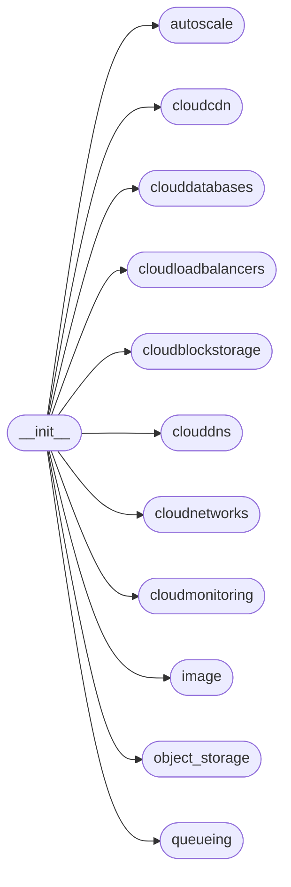
<!---Documatic-block-system_architecture-end--->

# #
<!---Documatic-section-Codebase Structure-end--->

<!---Documatic-section-pyrax.__init__.get_environment-start--->
## pyrax.__init__.get_environment

<!---Documatic-section-get_environment-start--->
<!---Documatic-block-pyrax.__init__.get_environment-start--->
<details>
	<summary><code>pyrax.__init__.get_environment</code> code snippet</summary>

```python
def get_environment():
    return settings.environment
```
</details>
<!---Documatic-block-pyrax.__init__.get_environment-end--->
<!---Documatic-section-get_environment-end--->

# #
<!---Documatic-section-pyrax.__init__.get_environment-end--->

<!---Documatic-section-pyrax.__init__.set_environment-start--->
## pyrax.__init__.set_environment

<!---Documatic-section-set_environment-start--->
<!---Documatic-block-pyrax.__init__.set_environment-start--->
<details>
	<summary><code>pyrax.__init__.set_environment</code> code snippet</summary>

```python
def set_environment(env):
    settings.environment = env
```
</details>
<!---Documatic-block-pyrax.__init__.set_environment-end--->
<!---Documatic-section-set_environment-end--->

# #
<!---Documatic-section-pyrax.__init__.set_environment-end--->

<!---Documatic-section-pyrax.__init__.list_environments-start--->
## pyrax.__init__.list_environments

<!---Documatic-section-list_environments-start--->
<!---Documatic-block-pyrax.__init__.list_environments-start--->
<details>
	<summary><code>pyrax.__init__.list_environments</code> code snippet</summary>

```python
def list_environments():
    return settings.environments
```
</details>
<!---Documatic-block-pyrax.__init__.list_environments-end--->
<!---Documatic-section-list_environments-end--->

# #
<!---Documatic-section-pyrax.__init__.list_environments-end--->

<!---Documatic-section-pyrax.__init__.get_setting-start--->
## pyrax.__init__.get_setting

<!---Documatic-section-get_setting-start--->
<!---Documatic-block-pyrax.__init__.get_setting-start--->
<details>
	<summary><code>pyrax.__init__.get_setting</code> code snippet</summary>

```python
def get_setting(key, env=None):
    return settings.get(key, env=env)
```
</details>
<!---Documatic-block-pyrax.__init__.get_setting-end--->
<!---Documatic-section-get_setting-end--->

# #
<!---Documatic-section-pyrax.__init__.get_setting-end--->

<!---Documatic-section-pyrax.__init__.set_setting-start--->
## pyrax.__init__.set_setting

<!---Documatic-section-set_setting-start--->
<!---Documatic-block-pyrax.__init__.set_setting-start--->
<details>
	<summary><code>pyrax.__init__.set_setting</code> code snippet</summary>

```python
def set_setting(key, val, env=None):
    return settings.set(key, val, env=env)
```
</details>
<!---Documatic-block-pyrax.__init__.set_setting-end--->
<!---Documatic-section-set_setting-end--->

# #
<!---Documatic-section-pyrax.__init__.set_setting-end--->

<!---Documatic-section-pyrax.__init__.set_default_region-start--->
## pyrax.__init__.set_default_region

<!---Documatic-section-set_default_region-start--->
<!---Documatic-block-pyrax.__init__.set_default_region-start--->
<details>
	<summary><code>pyrax.__init__.set_default_region</code> code snippet</summary>

```python
def set_default_region(region):
    global default_region
    default_region = region
```
</details>
<!---Documatic-block-pyrax.__init__.set_default_region-end--->
<!---Documatic-section-set_default_region-end--->

# #
<!---Documatic-section-pyrax.__init__.set_default_region-end--->

<!---Documatic-section-pyrax.__init__.create_context-start--->
## pyrax.__init__.create_context

<!---Documatic-section-create_context-start--->
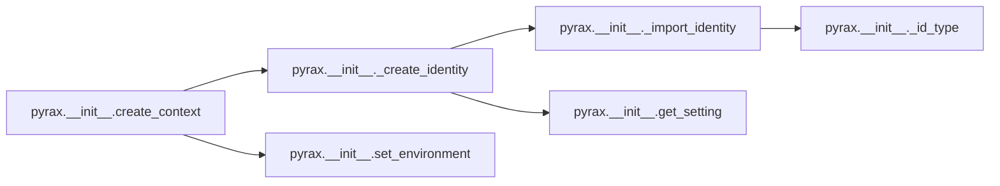

### Object Calls

* pyrax.__init__._create_identity
* pyrax.__init__.set_environment

<!---Documatic-block-pyrax.__init__.create_context-start--->
<details>
	<summary><code>pyrax.__init__.create_context</code> code snippet</summary>

```python
def create_context(id_type=None, env=None, username=None, password=None, tenant_id=None, tenant_name=None, api_key=None, verify_ssl=None):
    if env:
        set_environment(env)
    return _create_identity(id_type=id_type, username=username, password=password, tenant_id=tenant_id, tenant_name=tenant_name, api_key=api_key, verify_ssl=verify_ssl, return_context=True)
```
</details>
<!---Documatic-block-pyrax.__init__.create_context-end--->
<!---Documatic-section-create_context-end--->

# #
<!---Documatic-section-pyrax.__init__.create_context-end--->

<!---Documatic-section-pyrax.__init__.auth_with_token-start--->
## pyrax.__init__.auth_with_token

<!---Documatic-section-auth_with_token-start--->
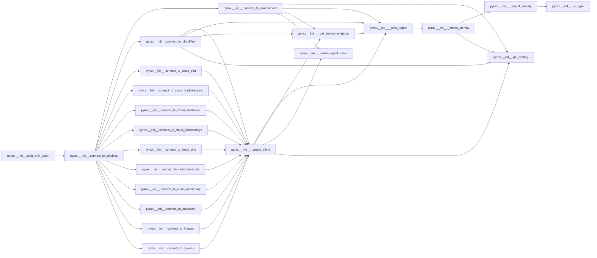

### Object Calls

* pyrax.__init__.connect_to_services

<!---Documatic-block-pyrax.__init__.auth_with_token-start--->
<details>
	<summary><code>pyrax.__init__.auth_with_token</code> code snippet</summary>

```python
@_assure_identity
def auth_with_token(token, tenant_id=None, tenant_name=None, region=None):
    global regions, services
    identity.auth_with_token(token, tenant_id=tenant_id, tenant_name=tenant_name)
    regions = tuple(identity.regions)
    services = tuple(identity.services.keys())
    connect_to_services(region=region)
```
</details>
<!---Documatic-block-pyrax.__init__.auth_with_token-end--->
<!---Documatic-section-auth_with_token-end--->

# #
<!---Documatic-section-pyrax.__init__.auth_with_token-end--->

<!---Documatic-section-pyrax.__init__.set_credentials-start--->
## pyrax.__init__.set_credentials

<!---Documatic-section-set_credentials-start--->
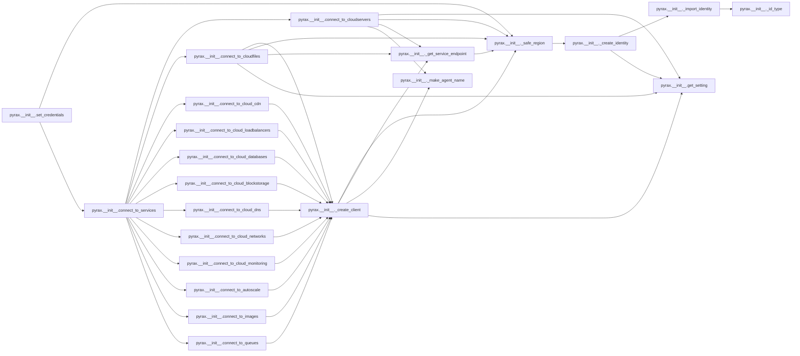

### Object Calls

* pyrax.__init__._safe_region
* pyrax.__init__.connect_to_services

<!---Documatic-block-pyrax.__init__.set_credentials-start--->
<details>
	<summary><code>pyrax.__init__.set_credentials</code> code snippet</summary>

```python
@_assure_identity
def set_credentials(username, api_key=None, password=None, region=None, tenant_id=None, authenticate=True):
    global regions, services
    pw_key = password or api_key
    region = _safe_region(region)
    tenant_id = tenant_id or settings.get('tenant_id')
    identity.set_credentials(username=username, password=pw_key, tenant_id=tenant_id, region=region, authenticate=authenticate)
    regions = tuple(identity.regions)
    services = tuple(identity.services.keys())
    connect_to_services(region=region)
```
</details>
<!---Documatic-block-pyrax.__init__.set_credentials-end--->
<!---Documatic-section-set_credentials-end--->

# #
<!---Documatic-section-pyrax.__init__.set_credentials-end--->

<!---Documatic-section-pyrax.__init__.set_credential_file-start--->
## pyrax.__init__.set_credential_file

<!---Documatic-section-set_credential_file-start--->
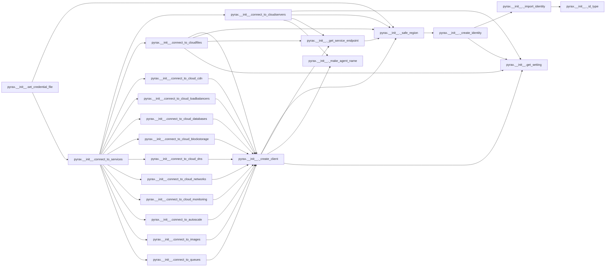

### Object Calls

* pyrax.__init__._safe_region
* pyrax.__init__.connect_to_services

<!---Documatic-block-pyrax.__init__.set_credential_file-start--->
<details>
	<summary><code>pyrax.__init__.set_credential_file</code> code snippet</summary>

```python
@_assure_identity
def set_credential_file(cred_file, region=None, authenticate=True):
    global regions, services
    region = _safe_region(region)
    identity.set_credential_file(cred_file, region=region, authenticate=authenticate)
    regions = tuple(identity.regions)
    services = tuple(identity.services.keys())
    connect_to_services(region=region)
```
</details>
<!---Documatic-block-pyrax.__init__.set_credential_file-end--->
<!---Documatic-section-set_credential_file-end--->

# #
<!---Documatic-section-pyrax.__init__.set_credential_file-end--->

<!---Documatic-section-pyrax.__init__.keyring_auth-start--->
## pyrax.__init__.keyring_auth

<!---Documatic-section-keyring_auth-start--->
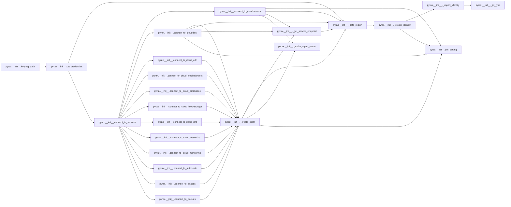

### Object Calls

* pyrax.__init__.set_credentials

<!---Documatic-block-pyrax.__init__.keyring_auth-start--->
<details>
	<summary><code>pyrax.__init__.keyring_auth</code> code snippet</summary>

```python
def keyring_auth(username=None, region=None, authenticate=True):
    if not keyring:
        raise exc.KeyringModuleNotInstalled("The 'keyring' Python module is not installed on this system.")
    if username is None:
        username = settings.get('keyring_username')
    if not username:
        raise exc.KeyringUsernameMissing('No username specified for keyring authentication.')
    password = keyring.get_password('pyrax', username)
    if password is None:
        raise exc.KeyringPasswordNotFound("No password was found for the username '%s'." % username)
    set_credentials(username, password, region=region, authenticate=authenticate)
```
</details>
<!---Documatic-block-pyrax.__init__.keyring_auth-end--->
<!---Documatic-section-keyring_auth-end--->

# #
<!---Documatic-section-pyrax.__init__.keyring_auth-end--->

<!---Documatic-section-pyrax.__init__.authenticate-start--->
## pyrax.__init__.authenticate

<!---Documatic-section-authenticate-start--->
<!---Documatic-block-pyrax.__init__.authenticate-start--->
<details>
	<summary><code>pyrax.__init__.authenticate</code> code snippet</summary>

```python
@_assure_identity
def authenticate(connect=True):
    identity.authenticate()
```
</details>
<!---Documatic-block-pyrax.__init__.authenticate-end--->
<!---Documatic-section-authenticate-end--->

# #
<!---Documatic-section-pyrax.__init__.authenticate-end--->

<!---Documatic-section-pyrax.__init__.clear_credentials-start--->
## pyrax.__init__.clear_credentials

<!---Documatic-section-clear_credentials-start--->
<!---Documatic-block-pyrax.__init__.clear_credentials-start--->
<details>
	<summary><code>pyrax.__init__.clear_credentials</code> code snippet</summary>

```python
def clear_credentials():
    global identity, regions, services, cloudservers, cloudfiles, cloud_cdn
    global cloud_loadbalancers, cloud_databases, cloud_blockstorage, cloud_dns
    global cloud_networks, cloud_monitoring, autoscale, images, queues
    identity = None
    regions = tuple()
    services = tuple()
    cloudservers = None
    cloudfiles = None
    cloud_cdn = None
    cloud_loadbalancers = None
    cloud_databases = None
    cloud_blockstorage = None
    cloud_dns = None
    cloud_networks = None
    cloud_monitoring = None
    autoscale = None
    images = None
    queues = None
```
</details>
<!---Documatic-block-pyrax.__init__.clear_credentials-end--->
<!---Documatic-section-clear_credentials-end--->

# #
<!---Documatic-section-pyrax.__init__.clear_credentials-end--->

<!---Documatic-section-pyrax.__init__.connect_to_services-start--->
## pyrax.__init__.connect_to_services

<!---Documatic-section-connect_to_services-start--->
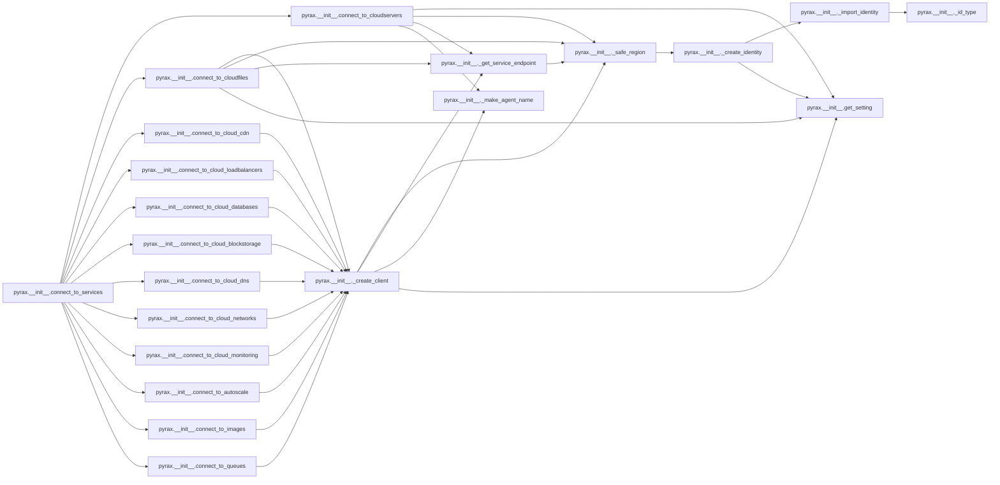

### Object Calls

* pyrax.__init__.connect_to_cloudservers
* pyrax.__init__.connect_to_cloudfiles
* pyrax.__init__.connect_to_cloud_cdn
* pyrax.__init__.connect_to_cloud_loadbalancers
* pyrax.__init__.connect_to_cloud_databases
* pyrax.__init__.connect_to_cloud_blockstorage
* pyrax.__init__.connect_to_cloud_dns
* pyrax.__init__.connect_to_cloud_networks
* pyrax.__init__.connect_to_cloud_monitoring
* pyrax.__init__.connect_to_autoscale
* pyrax.__init__.connect_to_images
* pyrax.__init__.connect_to_queues

<!---Documatic-block-pyrax.__init__.connect_to_services-start--->
<details>
	<summary><code>pyrax.__init__.connect_to_services</code> code snippet</summary>

```python
def connect_to_services(region=None):
    global cloudservers, cloudfiles, cloud_loadbalancers, cloud_databases
    global cloud_blockstorage, cloud_dns, cloud_networks, cloud_monitoring
    global autoscale, images, queues, cloud_cdn
    cloudservers = connect_to_cloudservers(region=region)
    cloudfiles = connect_to_cloudfiles(region=region)
    cloud_cdn = connect_to_cloud_cdn(region=region)
    cloud_loadbalancers = connect_to_cloud_loadbalancers(region=region)
    cloud_databases = connect_to_cloud_databases(region=region)
    cloud_blockstorage = connect_to_cloud_blockstorage(region=region)
    cloud_dns = connect_to_cloud_dns(region=region)
    cloud_networks = connect_to_cloud_networks(region=region)
    cloud_monitoring = connect_to_cloud_monitoring(region=region)
    autoscale = connect_to_autoscale(region=region)
    images = connect_to_images(region=region)
    queues = connect_to_queues(region=region)
```
</details>
<!---Documatic-block-pyrax.__init__.connect_to_services-end--->
<!---Documatic-section-connect_to_services-end--->

# #
<!---Documatic-section-pyrax.__init__.connect_to_services-end--->

<!---Documatic-section-pyrax.__init__.connect_to_cloudservers-start--->
## pyrax.__init__.connect_to_cloudservers

<!---Documatic-section-connect_to_cloudservers-start--->
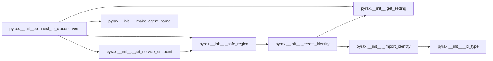

### Object Calls

* pyrax.__init__.get_setting
* pyrax.__init__._safe_region
* pyrax.__init__._get_service_endpoint
* pyrax.__init__._make_agent_name

<!---Documatic-block-pyrax.__init__.connect_to_cloudservers-start--->
<details>
	<summary><code>pyrax.__init__.connect_to_cloudservers</code> code snippet</summary>

```python
def connect_to_cloudservers(region=None, context=None, verify_ssl=None, **kwargs):
    context = context or identity
    _cs_auth_plugin.discover_auth_systems()
    id_type = get_setting('identity_type')
    if id_type != 'keystone':
        auth_plugin = _cs_auth_plugin.load_plugin(id_type)
    else:
        auth_plugin = None
    region = _safe_region(region, context=context)
    mgt_url = _get_service_endpoint(context, 'compute', region)
    cloudservers = None
    if not mgt_url:
        return
    if verify_ssl is None:
        insecure = not get_setting('verify_ssl')
    else:
        insecure = not verify_ssl
    try:
        extensions = nc.discover_extensions(_cs_max_version)
    except AttributeError:
        extensions = None
    clt_class = _cs_client.get_client_class(_cs_max_version)
    cloudservers = clt_class(context.username, context.password, project_id=context.tenant_id, auth_url=context.auth_endpoint, auth_system=id_type, region_name=region, service_type='compute', auth_plugin=auth_plugin, insecure=insecure, extensions=extensions, http_log_debug=_http_debug, **kwargs)
    agt = cloudservers.client.USER_AGENT
    cloudservers.client.USER_AGENT = _make_agent_name(agt)
    cloudservers.client.management_url = mgt_url
    cloudservers.client.auth_token = context.token
    cloudservers.exceptions = _cs_exceptions
    cloudservers.list_images = cloudservers.images.list
    cloudservers.list_flavors = cloudservers.flavors.list
    cloudservers.list = cloudservers.servers.list

    def list_base_images():
        """
        Returns a list of all base images; excludes any images created
        by this account.
        """
        return [image for image in cloudservers.images.list() if not hasattr(image, 'server')]

    def list_snapshots():
        """
        Returns a list of all images created by this account; in other words, it
        excludes all the base images.
        """
        return [image for image in cloudservers.images.list() if hasattr(image, 'server')]

    def find_images_by_name(expr):
        """
        Returns a list of images whose name contains the specified expression.
        The value passed is treated as a regular expression, allowing for more
        specific searches than simple wildcards. The matching is done in a
        case-insensitive manner.
        """
        return [image for image in cloudservers.images.list() if re.search(expr, image.name, re.I)]
    cloudservers.list_base_images = list_base_images
    cloudservers.list_snapshots = list_snapshots
    cloudservers.find_images_by_name = find_images_by_name
    cloudservers.identity = identity
    return cloudservers
```
</details>
<!---Documatic-block-pyrax.__init__.connect_to_cloudservers-end--->
<!---Documatic-section-connect_to_cloudservers-end--->

# #
<!---Documatic-section-pyrax.__init__.connect_to_cloudservers-end--->

<!---Documatic-section-pyrax.__init__.connect_to_cloudfiles-start--->
## pyrax.__init__.connect_to_cloudfiles

<!---Documatic-section-connect_to_cloudfiles-start--->
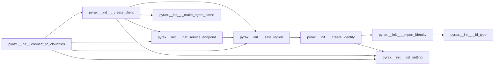

### Object Calls

* pyrax.__init__._create_client
* pyrax.__init__._safe_region
* pyrax.__init__._get_service_endpoint
* pyrax.__init__.get_setting

<!---Documatic-block-pyrax.__init__.connect_to_cloudfiles-start--->
<details>
	<summary><code>pyrax.__init__.connect_to_cloudfiles</code> code snippet</summary>

```python
def connect_to_cloudfiles(region=None, public=None):
    if public is None:
        is_public = not bool(get_setting('use_servicenet'))
    else:
        is_public = public
    ret = _create_client(ep_name='object_store', region=region, public=is_public)
    if ret:
        region = _safe_region(region)
        ret.cdn_management_url = _get_service_endpoint(None, 'object_cdn', region, public=is_public)
    return ret
```
</details>
<!---Documatic-block-pyrax.__init__.connect_to_cloudfiles-end--->
<!---Documatic-section-connect_to_cloudfiles-end--->

# #
<!---Documatic-section-pyrax.__init__.connect_to_cloudfiles-end--->

<!---Documatic-section-pyrax.__init__.connect_to_cloud_databases-start--->
## pyrax.__init__.connect_to_cloud_databases

<!---Documatic-section-connect_to_cloud_databases-start--->
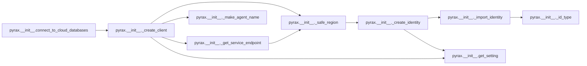

### Object Calls

* pyrax.__init__._create_client

<!---Documatic-block-pyrax.__init__.connect_to_cloud_databases-start--->
<details>
	<summary><code>pyrax.__init__.connect_to_cloud_databases</code> code snippet</summary>

```python
def connect_to_cloud_databases(region=None):
    return _create_client(ep_name='database', region=region)
```
</details>
<!---Documatic-block-pyrax.__init__.connect_to_cloud_databases-end--->
<!---Documatic-section-connect_to_cloud_databases-end--->

# #
<!---Documatic-section-pyrax.__init__.connect_to_cloud_databases-end--->

<!---Documatic-section-pyrax.__init__.connect_to_cloud_cdn-start--->
## pyrax.__init__.connect_to_cloud_cdn

<!---Documatic-section-connect_to_cloud_cdn-start--->
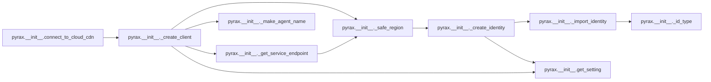

### Object Calls

* pyrax.__init__._create_client

<!---Documatic-block-pyrax.__init__.connect_to_cloud_cdn-start--->
<details>
	<summary><code>pyrax.__init__.connect_to_cloud_cdn</code> code snippet</summary>

```python
def connect_to_cloud_cdn(region=None):
    global default_region
    if region in ['DFW', 'IAD', 'ORD', 'SYD', 'HKG']:
        return _create_client(ep_name='cdn', region='DFW')
    elif region in ['LON']:
        return _create_client(ep_name='cdn', region='LON')
    elif default_region in ['DFW', 'IAD', 'ORD', 'SYD', 'HKG']:
        return _create_client(ep_name='cdn', region='DFW')
    elif default_region in ['LON']:
        return _create_client(ep_name='cdn', region='LON')
    else:
        return _create_client(ep_name='cdn', region=region)
```
</details>
<!---Documatic-block-pyrax.__init__.connect_to_cloud_cdn-end--->
<!---Documatic-section-connect_to_cloud_cdn-end--->

# #
<!---Documatic-section-pyrax.__init__.connect_to_cloud_cdn-end--->

<!---Documatic-section-pyrax.__init__.connect_to_cloud_loadbalancers-start--->
## pyrax.__init__.connect_to_cloud_loadbalancers

<!---Documatic-section-connect_to_cloud_loadbalancers-start--->
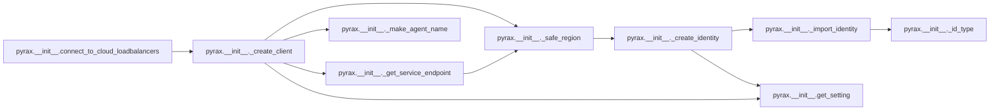

### Object Calls

* pyrax.__init__._create_client

<!---Documatic-block-pyrax.__init__.connect_to_cloud_loadbalancers-start--->
<details>
	<summary><code>pyrax.__init__.connect_to_cloud_loadbalancers</code> code snippet</summary>

```python
def connect_to_cloud_loadbalancers(region=None):
    return _create_client(ep_name='load_balancer', region=region)
```
</details>
<!---Documatic-block-pyrax.__init__.connect_to_cloud_loadbalancers-end--->
<!---Documatic-section-connect_to_cloud_loadbalancers-end--->

# #
<!---Documatic-section-pyrax.__init__.connect_to_cloud_loadbalancers-end--->

<!---Documatic-section-pyrax.__init__.connect_to_cloud_blockstorage-start--->
## pyrax.__init__.connect_to_cloud_blockstorage

<!---Documatic-section-connect_to_cloud_blockstorage-start--->
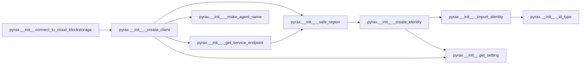

### Object Calls

* pyrax.__init__._create_client

<!---Documatic-block-pyrax.__init__.connect_to_cloud_blockstorage-start--->
<details>
	<summary><code>pyrax.__init__.connect_to_cloud_blockstorage</code> code snippet</summary>

```python
def connect_to_cloud_blockstorage(region=None):
    return _create_client(ep_name='volume', region=region)
```
</details>
<!---Documatic-block-pyrax.__init__.connect_to_cloud_blockstorage-end--->
<!---Documatic-section-connect_to_cloud_blockstorage-end--->

# #
<!---Documatic-section-pyrax.__init__.connect_to_cloud_blockstorage-end--->

<!---Documatic-section-pyrax.__init__.connect_to_cloud_dns-start--->
## pyrax.__init__.connect_to_cloud_dns

<!---Documatic-section-connect_to_cloud_dns-start--->
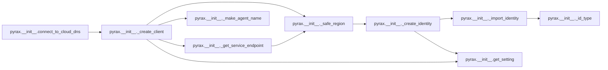

### Object Calls

* pyrax.__init__._create_client

<!---Documatic-block-pyrax.__init__.connect_to_cloud_dns-start--->
<details>
	<summary><code>pyrax.__init__.connect_to_cloud_dns</code> code snippet</summary>

```python
def connect_to_cloud_dns(region=None):
    return _create_client(ep_name='dns', region=region)
```
</details>
<!---Documatic-block-pyrax.__init__.connect_to_cloud_dns-end--->
<!---Documatic-section-connect_to_cloud_dns-end--->

# #
<!---Documatic-section-pyrax.__init__.connect_to_cloud_dns-end--->

<!---Documatic-section-pyrax.__init__.connect_to_cloud_networks-start--->
## pyrax.__init__.connect_to_cloud_networks

<!---Documatic-section-connect_to_cloud_networks-start--->
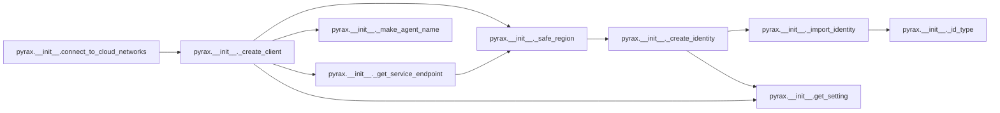

### Object Calls

* pyrax.__init__._create_client

<!---Documatic-block-pyrax.__init__.connect_to_cloud_networks-start--->
<details>
	<summary><code>pyrax.__init__.connect_to_cloud_networks</code> code snippet</summary>

```python
def connect_to_cloud_networks(region=None):
    return _create_client(ep_name='compute:network', region=region)
```
</details>
<!---Documatic-block-pyrax.__init__.connect_to_cloud_networks-end--->
<!---Documatic-section-connect_to_cloud_networks-end--->

# #
<!---Documatic-section-pyrax.__init__.connect_to_cloud_networks-end--->

<!---Documatic-section-pyrax.__init__.connect_to_cloud_monitoring-start--->
## pyrax.__init__.connect_to_cloud_monitoring

<!---Documatic-section-connect_to_cloud_monitoring-start--->


### Object Calls

* pyrax.__init__._create_client

<!---Documatic-block-pyrax.__init__.connect_to_cloud_monitoring-start--->
<details>
	<summary><code>pyrax.__init__.connect_to_cloud_monitoring</code> code snippet</summary>

```python
def connect_to_cloud_monitoring(region=None):
    return _create_client(ep_name='monitor', region=region)
```
</details>
<!---Documatic-block-pyrax.__init__.connect_to_cloud_monitoring-end--->
<!---Documatic-section-connect_to_cloud_monitoring-end--->

# #
<!---Documatic-section-pyrax.__init__.connect_to_cloud_monitoring-end--->

<!---Documatic-section-pyrax.__init__.connect_to_autoscale-start--->
## pyrax.__init__.connect_to_autoscale

<!---Documatic-section-connect_to_autoscale-start--->
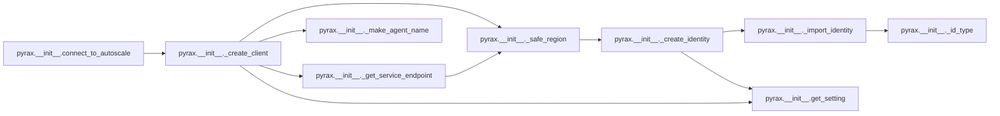

### Object Calls

* pyrax.__init__._create_client

<!---Documatic-block-pyrax.__init__.connect_to_autoscale-start--->
<details>
	<summary><code>pyrax.__init__.connect_to_autoscale</code> code snippet</summary>

```python
def connect_to_autoscale(region=None):
    return _create_client(ep_name='autoscale', region=region)
```
</details>
<!---Documatic-block-pyrax.__init__.connect_to_autoscale-end--->
<!---Documatic-section-connect_to_autoscale-end--->

# #
<!---Documatic-section-pyrax.__init__.connect_to_autoscale-end--->

<!---Documatic-section-pyrax.__init__.connect_to_images-start--->
## pyrax.__init__.connect_to_images

<!---Documatic-section-connect_to_images-start--->
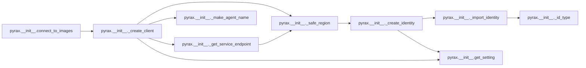

### Object Calls

* pyrax.__init__._create_client

<!---Documatic-block-pyrax.__init__.connect_to_images-start--->
<details>
	<summary><code>pyrax.__init__.connect_to_images</code> code snippet</summary>

```python
def connect_to_images(region=None, public=True):
    return _create_client(ep_name='image', region=region, public=public)
```
</details>
<!---Documatic-block-pyrax.__init__.connect_to_images-end--->
<!---Documatic-section-connect_to_images-end--->

# #
<!---Documatic-section-pyrax.__init__.connect_to_images-end--->

<!---Documatic-section-pyrax.__init__.connect_to_queues-start--->
## pyrax.__init__.connect_to_queues

<!---Documatic-section-connect_to_queues-start--->


### Object Calls

* pyrax.__init__._create_client

<!---Documatic-block-pyrax.__init__.connect_to_queues-start--->
<details>
	<summary><code>pyrax.__init__.connect_to_queues</code> code snippet</summary>

```python
def connect_to_queues(region=None, public=True):
    return _create_client(ep_name='queues', region=region, public=public)
```
</details>
<!---Documatic-block-pyrax.__init__.connect_to_queues-end--->
<!---Documatic-section-connect_to_queues-end--->

# #
<!---Documatic-section-pyrax.__init__.connect_to_queues-end--->

<!---Documatic-section-pyrax.__init__.client_class_for_service-start--->
## pyrax.__init__.client_class_for_service

<!---Documatic-section-client_class_for_service-start--->
<!---Documatic-block-pyrax.__init__.client_class_for_service-start--->
<details>
	<summary><code>pyrax.__init__.client_class_for_service</code> code snippet</summary>

```python
def client_class_for_service(service):
    return _client_classes.get(service)
```
</details>
<!---Documatic-block-pyrax.__init__.client_class_for_service-end--->
<!---Documatic-section-client_class_for_service-end--->

# #
<!---Documatic-section-pyrax.__init__.client_class_for_service-end--->

<!---Documatic-section-pyrax.__init__.get_http_debug-start--->
## pyrax.__init__.get_http_debug

<!---Documatic-section-get_http_debug-start--->
<!---Documatic-block-pyrax.__init__.get_http_debug-start--->
<details>
	<summary><code>pyrax.__init__.get_http_debug</code> code snippet</summary>

```python
def get_http_debug():
    return _http_debug
```
</details>
<!---Documatic-block-pyrax.__init__.get_http_debug-end--->
<!---Documatic-section-get_http_debug-end--->

# #
<!---Documatic-section-pyrax.__init__.get_http_debug-end--->

<!---Documatic-section-pyrax.__init__.set_http_debug-start--->
## pyrax.__init__.set_http_debug

<!---Documatic-section-set_http_debug-start--->
<!---Documatic-block-pyrax.__init__.set_http_debug-start--->
<details>
	<summary><code>pyrax.__init__.set_http_debug</code> code snippet</summary>

```python
def set_http_debug(val):
    global _http_debug
    _http_debug = val
    if identity:
        identity.http_log_debug = val
    for svc in (cloudservers, cloudfiles, cloud_loadbalancers, cloud_blockstorage, cloud_databases, cloud_dns, cloud_networks, autoscale, images, queues):
        if svc is not None:
            svc.http_log_debug = val
```
</details>
<!---Documatic-block-pyrax.__init__.set_http_debug-end--->
<!---Documatic-section-set_http_debug-end--->

# #
<!---Documatic-section-pyrax.__init__.set_http_debug-end--->

<!---Documatic-section-pyrax.__init__.get_encoding-start--->
## pyrax.__init__.get_encoding

<!---Documatic-section-get_encoding-start--->
<!---Documatic-block-pyrax.__init__.get_encoding-start--->
<details>
	<summary><code>pyrax.__init__.get_encoding</code> code snippet</summary>

```python
def get_encoding():
    return settings.get('encoding') or default_encoding
```
</details>
<!---Documatic-block-pyrax.__init__.get_encoding-end--->
<!---Documatic-section-get_encoding-end--->

# #
<!---Documatic-section-pyrax.__init__.get_encoding-end--->

<!---Documatic-section-pyrax.__init__.Settings-start--->
## pyrax.__init__.Settings

<!---Documatic-section-Settings-start--->
<!---Documatic-block-pyrax.__init__.Settings-start--->
<details>
	<summary><code>pyrax.__init__.Settings</code> code snippet</summary>

```python
class Settings(object):
    _environment = None
    env_dct = {'identity_type': 'CLOUD_ID_TYPE', 'auth_endpoint': 'CLOUD_AUTH_ENDPOINT', 'keyring_username': 'CLOUD_KEYRING_USER', 'region': 'CLOUD_REGION', 'tenant_id': 'CLOUD_TENANT_ID', 'tenant_name': 'CLOUD_TENANT_NAME', 'encoding': 'CLOUD_ENCODING', 'custom_user_agent': 'CLOUD_USER_AGENT', 'debug': 'CLOUD_DEBUG', 'verify_ssl': 'CLOUD_VERIFY_SSL', 'use_servicenet': 'USE_SERVICENET'}
    _settings = {'default': dict.fromkeys(list(env_dct.keys()))}
    _default_set = False

    def __init__(self, *args, **kwargs):
        if self._settings['default'].get('verify_ssl') is None:
            self._settings['default']['verify_ssl'] = True
        super(Settings, self).__init__(*args, **kwargs)

    def get(self, key, env=None):
        """
        Returns the config setting for the specified environment. If no
        environment is specified, the value for the current environment is
        returned. If an unknown key or environment is passed, None is returned.
        """
        if env is None:
            env = self.environment
        try:
            ret = self._settings[env][key]
        except KeyError:
            ret = None
        if ret is None:
            if key == 'identity_class':
                env_var = self.env_dct.get('identity_type')
                ityp = os.environ.get(env_var)
                if ityp:
                    return _import_identity(ityp)
            else:
                env_var = self.env_dct.get(key)
            if env_var is not None:
                ret = os.environ.get(env_var)
        return ret

    def set(self, key, val, env=None):
        """
        Changes the value for the setting specified by 'key' to the new value.
        By default this will change the current environment, but you can change
        values in other environments by passing the name of that environment as
        the 'env' parameter.
        """
        if env is None:
            env = self.environment
        elif env not in self._settings:
            raise exc.EnvironmentNotFound("There is no environment named '%s'." % env)
        dct = self._settings[env]
        if key not in dct:
            raise exc.InvalidSetting("The setting '%s' is not defined." % key)
        dct[key] = val
        if key == 'identity_type':
            dct['identity_class'] = _import_identity(val)
        elif key == 'region':
            if not identity:
                return
            current = identity.region
            if current == val:
                return
            if 'LON' in (current, val):
                identity.region = val
        elif key == 'verify_ssl':
            if not identity:
                return
            identity.verify_ssl = val

    def _getEnvironment(self):
        return self._environment or 'default'

    def _setEnvironment(self, val):
        if val not in self._settings:
            raise exc.EnvironmentNotFound("The environment '%s' has not been defined." % val)
        if val != self.environment:
            self._environment = val
            clear_credentials()
            _create_identity()
    environment = property(_getEnvironment, _setEnvironment, None, 'Users can define several environments for use with pyrax. This\n            holds the name of the current environment they are working in.\n            Changing this value will discard any existing authentication\n            credentials, and will set all the individual clients for cloud\n            services, such as `pyrax.cloudservers`, to None. You must\n            authenticate against the new environment with the credentials\n            appropriate for that cloud provider.')

    @property
    def environments(self):
        return list(self._settings.keys())

    def read_config(self, config_file):
        """
        Parses the specified configuration file and stores the values. Raises
        an InvalidConfigurationFile exception if the file is not well-formed.
        """
        cfg = ConfigParser.SafeConfigParser()
        try:
            cfg.read(config_file)
        except ConfigParser.MissingSectionHeaderError as e:
            raise exc.InvalidConfigurationFile(e)

        def safe_get(section, option, default=None):
            try:
                return cfg.get(section, option)
            except (ConfigParser.NoSectionError, ConfigParser.NoOptionError):
                return default
        creds_found = False
        for section in cfg.sections():
            if section == 'settings':
                section_name = 'default'
                self._default_set = True
            else:
                section_name = section
            for key in ('username', 'password', 'api_key'):
                if creds_found:
                    break
                if safe_get(section, key):
                    creds_found = True
            dct = self._settings[section_name] = {}
            dct['region'] = safe_get(section, 'region', default_region)
            ityp = safe_get(section, 'identity_type')
            if ityp:
                dct['identity_type'] = _id_type(ityp)
                dct['identity_class'] = _import_identity(ityp)
            debug = safe_get(section, 'debug')
            if debug is None:
                debug = safe_get(section, 'http_debug', 'False')
            dct['http_debug'] = debug == 'True'
            verify_ssl = safe_get(section, 'verify_ssl', 'True')
            dct['verify_ssl'] = verify_ssl == 'True'
            dct['keyring_username'] = safe_get(section, 'keyring_username')
            dct['encoding'] = safe_get(section, 'encoding', default_encoding)
            dct['auth_endpoint'] = safe_get(section, 'auth_endpoint')
            dct['tenant_name'] = safe_get(section, 'tenant_name')
            dct['tenant_id'] = safe_get(section, 'tenant_id')
            use_servicenet = safe_get(section, 'use_servicenet', 'False')
            dct['use_servicenet'] = use_servicenet == 'True'
            app_agent = safe_get(section, 'custom_user_agent')
            if app_agent:
                dct['user_agent'] = '%s %s' % (app_agent, USER_AGENT)
            else:
                dct['user_agent'] = USER_AGENT
            if not self._default_set:
                self._settings['default'] = self._settings[section]
                self._default_set = True
        if creds_found:
            warnings.warn("Login credentials were detected in your .pyrax.cfg file. These have been ignored, but you should remove them and either place them in a credential file, or consider using another means of authentication. More information on the use of credential files can be found in the 'docs/getting_started.md' document.")
```
</details>
<!---Documatic-block-pyrax.__init__.Settings-end--->
<!---Documatic-section-Settings-end--->

# #
<!---Documatic-section-pyrax.__init__.Settings-end--->

<!---Documatic-section-pyrax.__init__._make_agent_name-start--->
## pyrax.__init__._make_agent_name

<!---Documatic-section-_make_agent_name-start--->
<!---Documatic-block-pyrax.__init__._make_agent_name-start--->
<details>
	<summary><code>pyrax.__init__._make_agent_name</code> code snippet</summary>

```python
def _make_agent_name(base):
    if base:
        if 'pyrax' in base:
            return base
        else:
            return '%s %s' % (USER_AGENT, base)
    else:
        return USER_AGENT
```
</details>
<!---Documatic-block-pyrax.__init__._make_agent_name-end--->
<!---Documatic-section-_make_agent_name-end--->

# #
<!---Documatic-section-pyrax.__init__._make_agent_name-end--->

<!---Documatic-section-pyrax.__init__._create_identity-start--->
## pyrax.__init__._create_identity

<!---Documatic-section-_create_identity-start--->
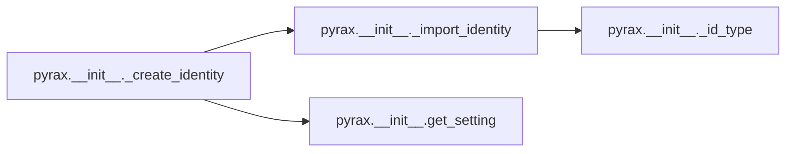

### Object Calls

* pyrax.__init__._import_identity
* pyrax.__init__.get_setting

<!---Documatic-block-pyrax.__init__._create_identity-start--->
<details>
	<summary><code>pyrax.__init__._create_identity</code> code snippet</summary>

```python
def _create_identity(id_type=None, username=None, password=None, tenant_id=None, tenant_name=None, api_key=None, verify_ssl=None, return_context=False):
    if id_type:
        cls = _import_identity(id_type)
    else:
        cls = settings.get('identity_class')
    if not cls:
        raise exc.IdentityClassNotDefined('No identity class has been defined for the current environment.')
    if verify_ssl is None:
        verify_ssl = get_setting('verify_ssl')
    context = cls(username=username, password=password, tenant_id=tenant_id, tenant_name=tenant_name, api_key=api_key, verify_ssl=verify_ssl)
    if return_context:
        return context
    else:
        global identity
        identity = context
```
</details>
<!---Documatic-block-pyrax.__init__._create_identity-end--->
<!---Documatic-section-_create_identity-end--->

# #
<!---Documatic-section-pyrax.__init__._create_identity-end--->

<!---Documatic-section-pyrax.__init__._get_service_endpoint-start--->
## pyrax.__init__._get_service_endpoint

<!---Documatic-section-_get_service_endpoint-start--->
```mermaid
flowchart LR
pyrax.__init__._get_service_endpoint-->pyrax.__init__._safe_region
pyrax.__init__._safe_region-->pyrax.__init__._create_identity
pyrax.__init__._create_identity-->pyrax.__init__._import_identity
pyrax.__init__._import_identity-->pyrax.__init__._id_type
pyrax.__init__._create_identity-->pyrax.__init__.get_setting
```

### Object Calls

* pyrax.__init__._safe_region

<!---Documatic-block-pyrax.__init__._get_service_endpoint-start--->
<details>
	<summary><code>pyrax.__init__._get_service_endpoint</code> code snippet</summary>

```python
def _get_service_endpoint(context, svc, region=None, public=True):
    region = _safe_region(region)
    context = context or identity
    url_type = {True: 'public', False: 'private'}[public]
    svc_obj = context.services.get(svc)
    if not svc_obj:
        return None
    ep = svc_obj.endpoints.get(region, {}).get(url_type)
    if not ep:
        ep = svc_obj.endpoints.get('ALL', {}).get(url_type)
    return ep
```
</details>
<!---Documatic-block-pyrax.__init__._get_service_endpoint-end--->
<!---Documatic-section-_get_service_endpoint-end--->

# #
<!---Documatic-section-pyrax.__init__._get_service_endpoint-end--->

<!---Documatic-section-pyrax.__init__._create_client-start--->
## pyrax.__init__._create_client

<!---Documatic-section-_create_client-start--->
```mermaid
flowchart LR
pyrax.__init__._create_client-->pyrax.__init__._safe_region
pyrax.__init__._safe_region-->pyrax.__init__._create_identity
pyrax.__init__._create_identity-->pyrax.__init__._import_identity
pyrax.__init__._import_identity-->pyrax.__init__._id_type
pyrax.__init__._create_identity-->pyrax.__init__.get_setting
pyrax.__init__._create_client-->pyrax.__init__._get_service_endpoint
pyrax.__init__._get_service_endpoint-->pyrax.__init__._safe_region
pyrax.__init__._create_client-->pyrax.__init__._make_agent_name
pyrax.__init__._create_client-->pyrax.__init__.get_setting
```

### Object Calls

* pyrax.__init__._safe_region
* pyrax.__init__._get_service_endpoint
* pyrax.__init__._make_agent_name
* pyrax.__init__.get_setting

<!---Documatic-block-pyrax.__init__._create_client-start--->
<details>
	<summary><code>pyrax.__init__._create_client</code> code snippet</summary>

```python
@_require_auth
def _create_client(ep_name, region, public=True, verify_ssl=None):
    region = _safe_region(region)
    ep = _get_service_endpoint(None, ep_name.split(':')[0], region, public=public)
    if not ep:
        return
    if verify_ssl is None:
        verify_ssl = get_setting('verify_ssl')
    cls = _client_classes[ep_name]
    client = cls(identity, region_name=region, management_url=ep, verify_ssl=verify_ssl, http_log_debug=_http_debug)
    client.user_agent = _make_agent_name(client.user_agent)
    return client
```
</details>
<!---Documatic-block-pyrax.__init__._create_client-end--->
<!---Documatic-section-_create_client-end--->

# #
<!---Documatic-section-pyrax.__init__._create_client-end--->

<!---Documatic-section-pyrax.__init__._safe_region-start--->
## pyrax.__init__._safe_region

<!---Documatic-section-_safe_region-start--->
```mermaid
flowchart LR
pyrax.__init__._safe_region-->pyrax.__init__._create_identity
pyrax.__init__._create_identity-->pyrax.__init__._import_identity
pyrax.__init__._import_identity-->pyrax.__init__._id_type
pyrax.__init__._create_identity-->pyrax.__init__.get_setting
```

### Object Calls

* pyrax.__init__._create_identity

<!---Documatic-block-pyrax.__init__._safe_region-start--->
<details>
	<summary><code>pyrax.__init__._safe_region</code> code snippet</summary>

```python
def _safe_region(region=None, context=None):
    ret = region or settings.get('region')
    context = context or identity
    if not ret:
        if not context:
            _create_identity()
            context = identity
        ret = context.get_default_region()
    if not ret:
        try:
            ret = regions[0]
        except IndexError:
            ret = ''
    return ret
```
</details>
<!---Documatic-block-pyrax.__init__._safe_region-end--->
<!---Documatic-section-_safe_region-end--->

# #
<!---Documatic-section-pyrax.__init__._safe_region-end--->

[_Documentation generated by Documatic_](https://www.documatic.com)