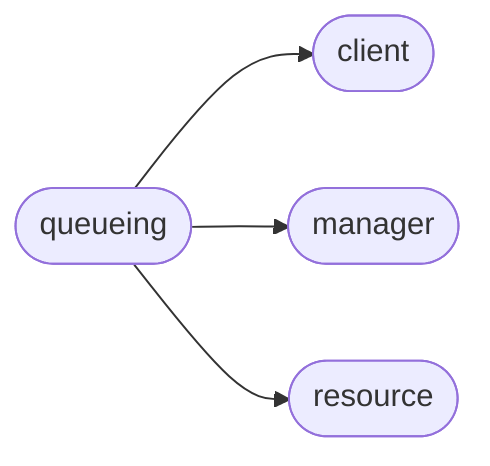

# Pyrax Queueing

[_Documentation generated by Documatic_](https://www.documatic.com)

<!---Documatic-section-Codebase Structure-start--->
## Codebase Structure

<!---Documatic-block-system_architecture-start--->

<!---Documatic-block-system_architecture-end--->

# #
<!---Documatic-section-Codebase Structure-end--->

<!---Documatic-section-pyrax.queueing.QueueClient-start--->
## [pyrax.queueing.QueueClient](12-pyrax_queueing.md#pyrax.queueing.QueueClient)

<!---Documatic-section-QueueClient-start--->
<!---Documatic-block-pyrax.queueing.QueueClient-start--->
<details>
	<summary><code>pyrax.queueing.QueueClient</code> code snippet</summary>

```python
class QueueClient(BaseClient):
    name = 'Cloud Queues'
    client_id = None

    def _configure_manager(self):
        """
        Create the manager to handle queues.
        """
        self._manager = QueueManager(self, resource_class=Queue, response_key='queue', uri_base='queues')

    def _add_custom_headers(self, dct):
        """
        Add the Client-ID header required by Cloud Queues
        """
        if self.client_id is None:
            self.client_id = os.environ.get('CLOUD_QUEUES_ID')
        if self.client_id:
            dct['Client-ID'] = self.client_id

    def _api_request(self, uri, method, **kwargs):
        """
        Any request that involves messages must define the client ID. This
        handles all failures due to lack of client ID and raises the
        appropriate exception.
        """
        try:
            return super(QueueClient, self)._api_request(uri, method, **kwargs)
        except exc.BadRequest as e:
            if e.code == '400' and e.message == 'The "Client-ID" header is required.':
                raise exc.QueueClientIDNotDefined('You must supply a client ID to work with Queue messages.')
            else:
                raise

    def get_home_document(self):
        """
        You should never need to use this method; it is included for
        completeness. It is meant to be used for API clients that need to
        explore the API with no prior knowledge. This knowledge is already
        included in the SDK, so it should never be necessary to work at this
        basic a level, as all the functionality is exposed through normal
        Python methods in the client.

        If you are curious about the 'Home Document' concept, here is the
        explanation from the Cloud Queues documentation:

        The entire API is discoverable from a single starting point - the home
        document. You do not need to know any more than this one URI in order
        to explore the entire API. This document is cacheable.

        The home document lets you write clients using a "follow-your-nose"
        style so clients do not have to construct their own URLs. You can click
        through and view the JSON doc in your browser.

        For more information about home documents, see
        http://tools.ietf.org/html/draft-nottingham-json-home-02.
        """
        uri = self.management_url.rsplit('/', 1)[0]
        return self.method_get(uri)

    def queue_exists(self, name):
        """
        Returns True or False, depending on the existence of the named queue.
        """
        try:
            queue = self._manager.head(name)
            return True
        except exc.NotFound:
            return False

    def create(self, name):
        """
        Cloud Queues works differently, in that they use the name as the ID for
        the resource. So for create(), we need to check if a queue by that name
        exists already, and raise an exception if it does. If not, create the
        queue and return a reference object for it.
        """
        if self.queue_exists(name):
            raise exc.DuplicateQueue("The queue '%s' already exists." % name)
        return self._manager.create(name)

    def get_stats(self, queue):
        """
        Returns the message stats for the specified queue.
        """
        return self._manager.get_stats(queue)

    def get_metadata(self, queue):
        """
        Returns the metadata for the specified queue.
        """
        return self._manager.get_metadata(queue)

    def set_metadata(self, queue, metadata, clear=False):
        """
        Accepts a dictionary and adds that to the specified queue's metadata.
        If the 'clear' argument is passed as True, any existing metadata is
        replaced with the new metadata.
        """
        return self._manager.set_metadata(queue, metadata, clear=clear)

    @assure_queue
    def get_message(self, queue, msg_id):
        """
        Returns the message whose ID matches the supplied msg_id from the
        specified queue.
        """
        return queue.get_message(msg_id)

    @assure_queue
    def delete_message(self, queue, msg_id, claim_id=None):
        """
        Deletes the message whose ID matches the supplied msg_id from the
        specified queue. If the message has been claimed, the ID of that claim
        must be passed as the 'claim_id' parameter.
        """
        return queue.delete_message(msg_id, claim_id=claim_id)

    @assure_queue
    def list_messages(self, queue, include_claimed=False, echo=False, marker=None, limit=None):
        """
        Returns a list of messages for the specified queue.

        By default only unclaimed messages are returned; if you want claimed
        messages included, pass `include_claimed=True`. Also, the requester's
        own messages are not returned by default; if you want them included,
        pass `echo=True`.

        The 'marker' and 'limit' parameters are used to control pagination of
        results. 'Marker' is the ID of the last message returned, while 'limit'
        controls the number of messages returned per reuqest (default=20).
        """
        return queue.list(include_claimed=include_claimed, echo=echo, marker=marker, limit=limit)

    @assure_queue
    def list_messages_by_ids(self, queue, ids):
        """
        If you wish to retrieve a list of messages from a queue and know the
        IDs of those messages, you can pass in a list of those IDs, and only
        the matching messages will be returned. This avoids pulling down all
        the messages in a queue and filtering on the client side.
        """
        return queue.list_by_ids(ids)

    @assure_queue
    def delete_messages_by_ids(self, queue, ids):
        """
        Deletes the messages whose IDs are passed in from the specified queue.
        """
        return queue.delete_by_ids(ids)

    @assure_queue
    def list_messages_by_claim(self, queue, claim):
        """
        Returns a list of all the messages from the specified queue that have
        been claimed by the specified claim. The claim can be either a claim ID
        or a QueueClaim object.
        """
        return queue.list_by_claim(claim)

    @assure_queue
    def post_message(self, queue, body, ttl):
        """
        Create a message in the specified queue. The value of ttl must be
        between 60 and 1209600 seconds (14 days).
        """
        return queue.post_message(body, ttl)

    @assure_queue
    def claim_messages(self, queue, ttl, grace, count=None):
        """
        Claims up to `count` unclaimed messages from the specified queue. If
        count is not specified, the default is to claim 10 messages.

        The `ttl` parameter specifies how long the server should wait before
        releasing the claim. The ttl value MUST be between 60 and 43200 seconds.

        The `grace` parameter is the message grace period in seconds. The value
        of grace MUST be between 60 and 43200 seconds. The server extends the
        lifetime of claimed messages to be at least as long as the lifetime of
        the claim itself, plus a specified grace period to deal with crashed
        workers (up to 1209600 or 14 days including claim lifetime). If a
        claimed message would normally live longer than the grace period, its
        expiration will not be adjusted.

        Returns a QueueClaim object, whose 'messages' attribute contains the
        list of QueueMessage objects representing the claimed messages.
        """
        return queue.claim_messages(ttl, grace, count=count)

    @assure_queue
    def get_claim(self, queue, claim):
        """
        Returns a QueueClaim object with information about the specified claim.
        If no such claim exists, a NotFound exception is raised.
        """
        return queue.get_claim(claim)

    @assure_queue
    def update_claim(self, queue, claim, ttl=None, grace=None):
        """
        Updates the specified claim with either a new TTL or grace period, or
        both.
        """
        return queue.update_claim(claim, ttl=ttl, grace=grace)

    @assure_queue
    def release_claim(self, queue, claim):
        """
        Releases the specified claim and makes any messages previously claimed
        by this claim as available for processing by other workers.
        """
        return queue.release_claim(claim)
```
</details>
<!---Documatic-block-pyrax.queueing.QueueClient-end--->
<!---Documatic-section-QueueClient-end--->

# #
<!---Documatic-section-pyrax.queueing.QueueClient-end--->

[_Documentation generated by Documatic_](https://www.documatic.com)