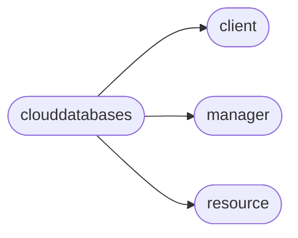

# Pyrax Clouddatabases

[_Documentation generated by Documatic_](https://www.documatic.com)

<!---Documatic-section-Codebase Structure-start--->
## Codebase Structure

<!---Documatic-block-system_architecture-start--->

<!---Documatic-block-system_architecture-end--->

# #
<!---Documatic-section-Codebase Structure-end--->

<!---Documatic-section-pyrax.clouddatabases.CloudDatabaseClient-start--->
## [pyrax.clouddatabases.CloudDatabaseClient](13-pyrax_clouddatabases.md#pyrax.clouddatabases.CloudDatabaseClient)

<!---Documatic-section-CloudDatabaseClient-start--->
<!---Documatic-block-pyrax.clouddatabases.CloudDatabaseClient-start--->
<details>
	<summary><code>pyrax.clouddatabases.CloudDatabaseClient</code> code snippet</summary>

```python
class CloudDatabaseClient(BaseClient):
    name = 'Cloud Databases'

    def _configure_manager(self):
        """
        Creates a manager to handle the instances, and another
        to handle flavors.
        """
        self._manager = CloudDatabaseManager(self, resource_class=CloudDatabaseInstance, response_key='instance', uri_base='instances')
        self._flavor_manager = BaseManager(self, resource_class=CloudDatabaseFlavor, response_key='flavor', uri_base='flavors')
        self._backup_manager = CloudDatabaseBackupManager(self, resource_class=CloudDatabaseBackup, response_key='backup', uri_base='backups')

    @assure_instance
    def list_databases(self, instance, limit=None, marker=None):
        """Returns all databases for the specified instance."""
        return instance.list_databases(limit=limit, marker=marker)

    @assure_instance
    def create_database(self, instance, name, character_set=None, collate=None):
        """Creates a database with the specified name on the given instance."""
        return instance.create_database(name, character_set=character_set, collate=collate)

    @assure_instance
    def get_database(self, instance, name):
        """
        Finds the database in the given instance with the specified name, and
        returns a CloudDatabaseDatabase object. If no match is found, a
        NoSuchDatabase exception is raised.
        """
        return instance.get_database(name)

    @assure_instance
    def delete_database(self, instance, name):
        """Deletes the database by name on the given instance."""
        return instance.delete_database(name)

    @assure_instance
    def list_users(self, instance, limit=None, marker=None):
        """Returns all users for the specified instance."""
        return instance.list_users(limit=limit, marker=marker)

    @assure_instance
    def create_user(self, instance, name, password, database_names, host=None):
        """
        Creates a user with the specified name and password, and gives that
        user access to the specified database(s).
        """
        return instance.create_user(name=name, password=password, database_names=database_names, host=host)

    @assure_instance
    def get_user(self, instance, name):
        """
        Finds the user in the given instance with the specified name, and
        returns a CloudDatabaseUser object. If no match is found, a
        NoSuchUser exception is raised.
        """
        return instance.get_user(name)

    @assure_instance
    def delete_user(self, instance, name):
        """Deletes the user by name on the given instance."""
        return instance.delete_user(name)

    @assure_instance
    def change_user_password(self, instance, user, new_pass):
        """
        Changes the password for the user of the specified instance to the
        supplied value.

        Returns None upon success; raises PasswordChangeFailed if the call
        does not complete successfully.
        """
        return instance.change_user_password(user, new_pass)

    @assure_instance
    def update_user(self, instance, user, name=None, password=None, host=None):
        """
        Allows you to change one or more of the user's username, password, or
        host.
        """
        return instance.update_user(user, name=name, password=password, host=host)

    @assure_instance
    def list_user_access(self, instance, user):
        """
        Returns a list of all database names for which the specified user
        has access rights on the specified instance.
        """
        return instance.list_user_access(user)

    @assure_instance
    def grant_user_access(self, instance, user, db_names, strict=True):
        """
        Gives access to the databases listed in `db_names` to the user
        on the specified instance.
        """
        return instance.grant_user_access(user, db_names, strict=strict)

    @assure_instance
    def revoke_user_access(self, instance, user, db_names, strict=True):
        """
        Revokes access to the databases listed in `db_names` for the user
        on the specified instance.
        """
        return instance.revoke_user_access(user, db_names, strict=strict)

    @assure_instance
    def enable_root_user(self, instance):
        """
        This enables login from any host for the root user and provides
        the user with a generated root password.
        """
        return instance.enable_root_user()

    @assure_instance
    def root_user_status(self, instance):
        """Returns True if the given instance is root-enabled."""
        return instance.root_user_status()

    @assure_instance
    def restart(self, instance):
        """Restarts the instance."""
        return instance.restart()

    @assure_instance
    def resize(self, instance, flavor):
        """Sets the size of the instance to a different flavor."""
        return instance.resize(flavor)

    def get_limits(self):
        """Not implemented in Cloud Databases."""
        raise NotImplementedError('Limits are not available for Cloud Databases')

    def list_flavors(self, limit=None, marker=None):
        """Returns a list of all available Flavors."""
        return self._flavor_manager.list(limit=limit, marker=marker)

    def get_flavor(self, flavor_id):
        """Returns a specific Flavor object by ID."""
        return self._flavor_manager.get(flavor_id)

    def _get_flavor_ref(self, flavor):
        """
        Flavors are odd in that the API expects an href link, not an ID, as with
        nearly every other resource. This method takes either a
        CloudDatabaseFlavor object, a flavor ID, a RAM size, or a flavor name,
        and uses that to determine the appropriate href.
        """
        flavor_obj = None
        if isinstance(flavor, CloudDatabaseFlavor):
            flavor_obj = flavor
        elif isinstance(flavor, int):
            try:
                flavor_obj = self.get_flavor(flavor)
            except exc.NotFound:
                pass
        if flavor_obj is None:
            flavors = self.list_flavors()
            try:
                flavor_obj = [flav for flav in flavors if flav.name == flavor][0]
            except IndexError:
                try:
                    flavor_obj = [flav for flav in flavors if flav.ram == flavor][0]
                except IndexError:
                    raise exc.FlavorNotFound("Could not determine flavor from '%s'." % flavor)
        href = [link['href'] for link in flavor_obj.links if link['rel'] == 'self'][0]
        return href

    def list_backups(self, instance=None, limit=20, marker=0):
        """
        Returns a paginated list of backups by default, or just for a particular
        instance.
        """
        return self._backup_manager.list(instance=instance, limit=limit, marker=marker)

    def get_backup(self, backup):
        """
        Returns the CloudDatabaseBackup instance for a given ID.
        """
        return self._backup_manager.get(backup)

    def delete_backup(self, backup):
        """
        Deletes the CloudDatabaseBackup instance for a given ID.
        """
        return self._backup_manager.delete(backup)

    @assure_instance
    def create_backup(self, instance, name, description=None):
        """
        Creates a backup of the specified instance, giving it the specified
        name along with an optional description.
        """
        return instance.create_backup(name, description=description)

    def restore_backup(self, backup, name, flavor, volume):
        """
        Restores a backup to a new database instance. You must supply a backup
        (either the ID or a CloudDatabaseBackup object), a name for the new
        instance, as well as a flavor and size (in GB) for the instance.
        """
        return self._manager.restore_backup(backup, name, flavor, volume)
```
</details>
<!---Documatic-block-pyrax.clouddatabases.CloudDatabaseClient-end--->
<!---Documatic-section-CloudDatabaseClient-end--->

# #
<!---Documatic-section-pyrax.clouddatabases.CloudDatabaseClient-end--->

[_Documentation generated by Documatic_](https://www.documatic.com)