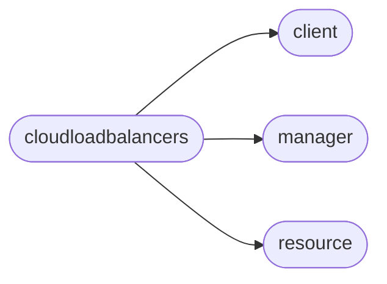

# Pyrax Cloudloadbalancers

[_Documentation generated by Documatic_](https://www.documatic.com)

<!---Documatic-section-Codebase Structure-start--->
## Codebase Structure

<!---Documatic-block-system_architecture-start--->

<!---Documatic-block-system_architecture-end--->

# #
<!---Documatic-section-Codebase Structure-end--->

<!---Documatic-section-pyrax.cloudloadbalancers.CloudLoadBalancerClient-start--->
## [pyrax.cloudloadbalancers.CloudLoadBalancerClient](14-pyrax_cloudloadbalancers.md#pyrax.cloudloadbalancers.CloudLoadBalancerClient)

<!---Documatic-section-CloudLoadBalancerClient-start--->
<!---Documatic-block-pyrax.cloudloadbalancers.CloudLoadBalancerClient-start--->
<details>
	<summary><code>pyrax.cloudloadbalancers.CloudLoadBalancerClient</code> code snippet</summary>

```python
class CloudLoadBalancerClient(BaseClient):
    name = 'Cloud Load Balancers'

    def __init__(self, *args, **kwargs):
        self.Node = Node
        self.VirtualIP = VirtualIP
        self._algorithms = None
        self._protocols = None
        self._allowed_domains = None
        super(CloudLoadBalancerClient, self).__init__(*args, **kwargs)

    def _configure_manager(self):
        """
        Creates a manager to handle the instances, and another
        to handle flavors.
        """
        self._manager = CloudLoadBalancerManager(self, resource_class=CloudLoadBalancer, response_key='loadBalancer', uri_base='loadbalancers')

    def get_usage(self, loadbalancer=None, start=None, end=None):
        """
        Return the load balancer usage records for this account. If 'loadbalancer'
        is None, records for all load balancers are returned. You may optionally
        include a start datetime or an end datetime, or both, which will limit
        the records to those on or after the start time, and those before or on the
        end time. These times should be Python datetime.datetime objects, Python
        datetime.date objects, or strings in the format: "YYYY-MM-DD HH:MM:SS" or
        "YYYY-MM-DD".
        """
        return self._manager.get_usage(loadbalancer=loadbalancer, start=start, end=end)

    @property
    def allowed_domains(self):
        """
        This property lists the allowed domains for a load balancer.

        The allowed domains are restrictions set for the allowed domain names
        used for adding load balancer nodes. In order to submit a domain name
        as an address for the load balancer node to add, the user must verify
        that the domain is valid by using the List Allowed Domains call. Once
        verified, simply supply the domain name in place of the node's address
        in the add_nodes() call.
        """
        if self._allowed_domains is None:
            uri = '/loadbalancers/alloweddomains'
            (resp, body) = self.method_get(uri)
            dom_list = body['allowedDomains']
            self._allowed_domains = [itm['allowedDomain']['name'] for itm in dom_list]
        return self._allowed_domains

    @property
    def algorithms(self):
        """
        Returns a list of available load balancing algorithms.
        """
        if self._algorithms is None:
            uri = '/loadbalancers/algorithms'
            (resp, body) = self.method_get(uri)
            self._algorithms = [alg['name'] for alg in body['algorithms']]
        return self._algorithms

    @property
    def protocols(self):
        """
        Returns a list of available load balancing protocols.
        """
        if self._protocols is None:
            uri = '/loadbalancers/protocols'
            (resp, body) = self.method_get(uri)
            self._protocols = [proto['name'] for proto in body['protocols']]
        return self._protocols

    @assure_loadbalancer
    def update(self, loadbalancer, name=None, algorithm=None, protocol=None, halfClosed=None, port=None, timeout=None, httpsRedirect=None):
        """
        Provides a way to modify the following attributes of a load balancer:
            - name
            - algorithm
            - protocol
            - halfClosed
            - port
            - timeout
            - httpsRedirect
        """
        return self._manager.update(loadbalancer, name=name, algorithm=algorithm, protocol=protocol, halfClosed=halfClosed, port=port, timeout=timeout, httpsRedirect=httpsRedirect)

    @assure_loadbalancer
    def add_nodes(self, loadbalancer, nodes):
        """Adds the nodes to this load balancer."""
        return loadbalancer.add_nodes(nodes)

    @assure_loadbalancer
    def add_virtualip(self, loadbalancer, vip):
        """Adds the virtual IP to this load balancer."""
        return loadbalancer.add_virtualip(vip)

    def delete_node(self, node):
        """Removes the node from its load balancer."""
        return node.delete()

    def update_node(self, node):
        """Updates the node's attributes."""
        return node.update()

    def delete_virtualip(self, vip):
        """Deletes the VirtualIP from its load balancer."""
        return vip.delete()

    @assure_loadbalancer
    def get_access_list(self, loadbalancer):
        """
        Returns the current access list for the load balancer.
        """
        return loadbalancer.get_access_list()

    @assure_loadbalancer
    def add_access_list(self, loadbalancer, access_list):
        """
        Adds the access list provided to the load balancer.

        The 'access_list' should be a dict in the following format:

            {"accessList": [
                {"address": "192.0.43.10", "type": "DENY"},
                {"address": "192.0.43.11", "type": "ALLOW"},
                ...
                {"address": "192.0.43.99", "type": "DENY"},
                ]
            }

        If no access list exists, it is created. If an access list
        already exists, it is updated with the provided list.
        """
        return loadbalancer.add_access_list(access_list)

    @assure_loadbalancer
    def delete_access_list(self, loadbalancer):
        """
        Removes the access list from this load balancer.
        """
        return loadbalancer.delete_access_list()

    @assure_loadbalancer
    def delete_access_list_items(self, loadbalancer, item_ids):
        """
        Removes the item(s) from the load balancer's access list
        that match the provided IDs. 'item_ids' should be one or
        more access list item IDs.
        """
        return loadbalancer.delete_access_list_items(item_ids)

    @assure_loadbalancer
    def get_health_monitor(self, loadbalancer):
        """
        Returns a dict representing the health monitor for the load
        balancer. If no monitor has been configured, returns an
        empty dict.
        """
        return loadbalancer.get_health_monitor()

    @assure_loadbalancer
    def add_health_monitor(self, loadbalancer, type, delay=10, timeout=10, attemptsBeforeDeactivation=3, path='/', statusRegex=None, bodyRegex=None, hostHeader=None):
        """
        Adds a health monitor to the load balancer. If a monitor already
        exists, it is updated with the supplied settings.
        """
        abd = attemptsBeforeDeactivation
        return loadbalancer.add_health_monitor(type=type, delay=delay, timeout=timeout, attemptsBeforeDeactivation=abd, path=path, statusRegex=statusRegex, bodyRegex=bodyRegex, hostHeader=hostHeader)

    @assure_loadbalancer
    def delete_health_monitor(self, loadbalancer):
        """
        Deletes the health monitor for the load balancer.
        """
        return loadbalancer.delete_health_monitor()

    @assure_loadbalancer
    def get_connection_throttle(self, loadbalancer):
        """
        Returns a dict representing the connection throttling information
        for the load balancer. If no connection throttle has been configured,
        returns an empty dict.
        """
        return loadbalancer.get_connection_throttle()

    @assure_loadbalancer
    def add_connection_throttle(self, loadbalancer, maxConnectionRate=None, maxConnections=None, minConnections=None, rateInterval=None):
        """
        Updates the connection throttling information for the load balancer with
        the supplied values. At least one of the parameters must be supplied.
        """
        return loadbalancer.add_connection_throttle(maxConnectionRate=maxConnectionRate, maxConnections=maxConnections, minConnections=minConnections, rateInterval=rateInterval)

    @assure_loadbalancer
    def delete_connection_throttle(self, loadbalancer):
        """
        Deletes all connection throttling settings for the load balancer.
        """
        return loadbalancer.delete_connection_throttle()

    @assure_loadbalancer
    def get_ssl_termination(self, loadbalancer):
        """
        Returns a dict representing the SSL termination configuration
        for the load balancer. If SSL termination has not been configured,
        returns an empty dict.
        """
        return loadbalancer.get_ssl_termination()

    @assure_loadbalancer
    def add_ssl_termination(self, loadbalancer, securePort, privatekey, certificate, intermediateCertificate, enabled=True, secureTrafficOnly=False):
        """
        Adds SSL termination information to the load balancer. If SSL termination
        has already been configured, it is updated with the supplied settings.
        """
        return loadbalancer.add_ssl_termination(securePort=securePort, privatekey=privatekey, certificate=certificate, intermediateCertificate=intermediateCertificate, enabled=enabled, secureTrafficOnly=secureTrafficOnly)

    @assure_loadbalancer
    def update_ssl_termination(self, loadbalancer, securePort=None, enabled=None, secureTrafficOnly=None):
        """
        Updates existing SSL termination information for the load balancer
        without affecting the existing certificates/keys.
        """
        return loadbalancer.update_ssl_termination(securePort=securePort, enabled=enabled, secureTrafficOnly=secureTrafficOnly)

    @assure_loadbalancer
    def delete_ssl_termination(self, loadbalancer):
        """
        Removes SSL termination for the load balancer.
        """
        return loadbalancer.delete_ssl_termination()

    @assure_loadbalancer
    def get_metadata(self, loadbalancer):
        """
        Returns the current metadata for the load balancer.
        """
        return loadbalancer.get_metadata()

    @assure_loadbalancer
    def set_metadata(self, loadbalancer, metadata):
        """
        Sets the metadata for the load balancer to the supplied dictionary
        of values. Any existing metadata is cleared.
        """
        return loadbalancer.set_metadata(metadata)

    @assure_loadbalancer
    def update_metadata(self, loadbalancer, metadata):
        """
        Updates the existing metadata for the load balancer with
        the supplied dictionary.
        """
        return loadbalancer.update_metadata(metadata)

    @assure_loadbalancer
    def delete_metadata(self, loadbalancer, keys=None):
        """
        Deletes metadata items specified by the 'keys' parameter for
        this load balancer. If no value for 'keys' is provided, all
        metadata is deleted.
        """
        return loadbalancer.delete_metadata(keys=keys)

    @assure_loadbalancer
    def get_metadata_for_node(self, loadbalancer, node):
        """
        Returns the current metadata for the specified node.
        """
        return loadbalancer.get_metadata_for_node(node)

    @assure_loadbalancer
    def set_metadata_for_node(self, loadbalancer, node, metadata):
        """
        Sets the metadata for the specified node to the supplied dictionary
        of values. Any existing metadata is cleared.
        """
        return loadbalancer.set_metadata_for_node(node, metadata)

    @assure_loadbalancer
    def update_metadata_for_node(self, loadbalancer, node, metadata):
        """
        Updates the existing metadata for the specified node with
        the supplied dictionary.
        """
        return loadbalancer.update_metadata_for_node(node, metadata)

    @assure_loadbalancer
    def delete_metadata_for_node(self, loadbalancer, node, keys=None):
        """
        Deletes metadata items specified by the 'keys' parameter for
        the specified node. If no value for 'keys' is provided, all
        metadata is deleted.
        """
        return loadbalancer.delete_metadata_for_node(node, keys=keys)

    @assure_loadbalancer
    def get_error_page(self, loadbalancer):
        """
        Load Balancers all have a default error page that is shown to
        an end user who is attempting to access a load balancer node
        that is offline/unavailable.
        """
        return loadbalancer.get_error_page()

    @assure_loadbalancer
    def set_error_page(self, loadbalancer, html):
        """
        A single custom error page may be added per account load balancer
        with an HTTP protocol. Page updates will override existing content.
        If a custom error page is deleted, or the load balancer is changed
        to a non-HTTP protocol, the default error page will be restored.
        """
        return loadbalancer.set_error_page(html)

    @assure_loadbalancer
    def clear_error_page(self, loadbalancer):
        """
        Resets the error page to the default.
        """
        return loadbalancer.clear_error_page()

    @assure_loadbalancer
    def get_connection_logging(self, loadbalancer):
        """
        Returns the current setting for connection logging for the load balancer.
        """
        return loadbalancer.connection_logging

    @assure_loadbalancer
    def set_connection_logging(self, loadbalancer, val):
        """
        Sets connection logging for the load balancer to either True
        or False.
        """
        loadbalancer.connection_logging = val

    @assure_loadbalancer
    def get_content_caching(self, loadbalancer):
        """
        Returns the current setting for content caching for the load balancer.
        """
        return loadbalancer.content_caching

    @assure_loadbalancer
    def set_content_caching(self, loadbalancer, val):
        """
        Sets content caching for the load balancer to either True
        or False.
        """
        loadbalancer.content_caching = val

    @assure_loadbalancer
    def get_session_persistence(self, loadbalancer):
        """
        Returns the current setting for session persistence for
        the load balancer.
        """
        return loadbalancer.session_persistence

    @assure_loadbalancer
    def set_session_persistence(self, loadbalancer, val):
        """
        Sets the type of session persistence for the load balancer. This
        must be one of either "HTTP_COOKIE" or "SOURCE_IP", depending
        on the type of load balancing.
        """
        loadbalancer.session_persistence = val
```
</details>
<!---Documatic-block-pyrax.cloudloadbalancers.CloudLoadBalancerClient-end--->
<!---Documatic-section-CloudLoadBalancerClient-end--->

# #
<!---Documatic-section-pyrax.cloudloadbalancers.CloudLoadBalancerClient-end--->

[_Documentation generated by Documatic_](https://www.documatic.com)