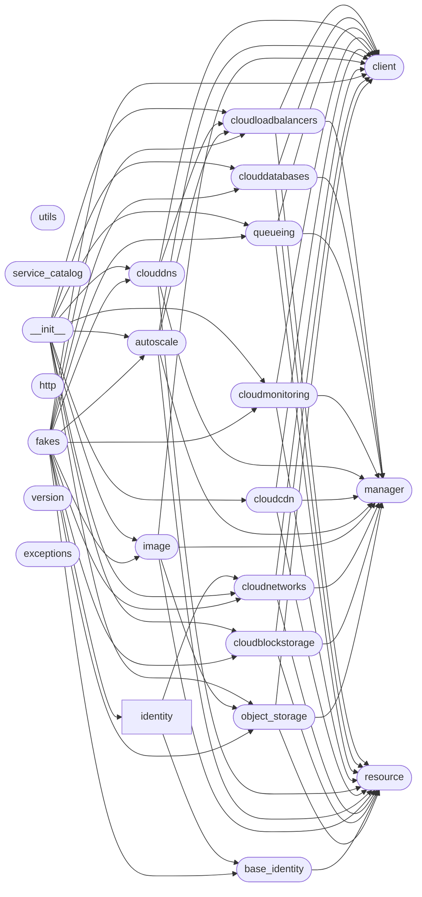

# Code Overview

[_Documentation generated by Documatic_](https://www.documatic.com)

<!---Documatic-section-Codebase Structure Python-start--->
## Codebase Structure Python

The codebase has a single-depth folder structure,
                with 25 code files in total.

<!---Documatic-block-system_architecture-start--->

<!---Documatic-block-system_architecture-end--->

# #
<!---Documatic-section-Codebase Structure Python-end--->

<!---Documatic-section-Key Objects-start--->
## Key Objects

There are exposed imports at level-0
from the source directory (pyrax)

<!---Documatic-block-pyrax-start--->

	
<code>pyrax</code> (Click to Expand!)

* `pyrax.autoscale.AutoScaleClient`
* `pyrax.cloudblockstorage.CloudBlockStorageClient`
* `pyrax.cloudcdn.CloudCDNClient`
* `pyrax.clouddatabases.CloudDatabaseClient`
* `pyrax.clouddns.CloudDNSClient`
* `pyrax.cloudloadbalancers.CloudLoadBalancerClient`
* `pyrax.cloudmonitoring.CloudMonitorClient`
* `pyrax.cloudnetworks.CloudNetworkClient`
* `pyrax.image.ImageClient`
* `pyrax.object_storage.StorageClient`
* `pyrax.queueing.QueueClient`

<!---Documatic-block-pyrax-end--->

# #
<!---Documatic-section-Key Objects-end--->

<!---Documatic-section-Important Functions-start--->
## Important Functions

<!---Documatic-block-important_funcs-start--->
<!---Documatic-block-end_user_funcs-start--->
### End User Exposed Functions

* [pyrax.clouddns.CloudDNSClient](9-pyrax_clouddns.md#pyrax.clouddns.CloudDNSClient)
* [pyrax.clouddatabases.CloudDatabaseClient](13-pyrax_clouddatabases.md#pyrax.clouddatabases.CloudDatabaseClient)
* [pyrax.cloudnetworks.CloudNetworkClient](5-pyrax_cloudnetworks.md#pyrax.cloudnetworks.CloudNetworkClient)
* [pyrax.queueing.QueueClient](12-pyrax_queueing.md#pyrax.queueing.QueueClient)
* [pyrax.image.ImageClient](6-pyrax_image.md#pyrax.image.ImageClient)
* [pyrax.cloudcdn.CloudCDNClient](8-pyrax_cloudcdn.md#pyrax.cloudcdn.CloudCDNClient)
* [pyrax.cloudblockstorage.CloudBlockStorageClient](4-pyrax_cloudblockstorage.md#pyrax.cloudblockstorage.CloudBlockStorageClient)
* [pyrax.autoscale.AutoScaleClient](7-pyrax_autoscale.md#pyrax.autoscale.AutoScaleClient)
* [pyrax.cloudloadbalancers.CloudLoadBalancerClient](14-pyrax_cloudloadbalancers.md#pyrax.cloudloadbalancers.CloudLoadBalancerClient)
* [pyrax.cloudmonitoring.CloudMonitorClient](10-pyrax_cloudmonitoring.md#pyrax.cloudmonitoring.CloudMonitorClient)
* pyrax.object_storage.StorageClient
* pyrax.__init__.get_environment
* pyrax.__init__.set_environment
* pyrax.__init__.list_environments
* pyrax.__init__.get_setting
* pyrax.__init__.set_setting
* pyrax.__init__.set_default_region
* pyrax.__init__.create_context
* pyrax.__init__.auth_with_token
* pyrax.__init__.set_credentials
* pyrax.__init__.set_credential_file
* pyrax.__init__.keyring_auth
* pyrax.__init__.authenticate
* pyrax.__init__.clear_credentials
* pyrax.__init__.connect_to_services
* pyrax.__init__.connect_to_cloudservers
* pyrax.__init__.connect_to_cloudfiles
* pyrax.__init__.connect_to_cloud_databases
* pyrax.__init__.connect_to_cloud_cdn
* pyrax.__init__.connect_to_cloud_loadbalancers
* pyrax.__init__.connect_to_cloud_blockstorage
* pyrax.__init__.connect_to_cloud_dns
* pyrax.__init__.connect_to_cloud_networks
* pyrax.__init__.connect_to_cloud_monitoring
* pyrax.__init__.connect_to_autoscale
* pyrax.__init__.connect_to_images
* pyrax.__init__.connect_to_queues
* pyrax.__init__.client_class_for_service
* pyrax.__init__.get_http_debug
* pyrax.__init__.set_http_debug
* pyrax.__init__.get_encoding
* pyrax.__init__.Settings
<!---Documatic-block-end_user_funcs-end--->
<!---Documatic-block-important_funcs-end--->

# #
<!---Documatic-section-Important Functions-end--->

<!---Documatic-section-File IO-start--->
## File IO

<!---Documatic-block-file_io-start--->
The following files have file read operations

<!---Documatic-block-pyrax-start--->

	
<code>pyrax</code> (Click to Expand!)

* pyrax.object_storage
* pyrax.utils

<!---Documatic-block-pyrax-end--->

The following files have file write operations

<!---Documatic-block-pyrax-start--->

	
<code>pyrax</code> (Click to Expand!)

* pyrax.object_storage

<!---Documatic-block-pyrax-end--->
<!---Documatic-block-file_io-end--->

# #
<!---Documatic-section-File IO-end--->

<!---Documatic-section-Class Hierarchy-start--->
## Class Hierarchy

<!---Documatic-block-BaseManager-start--->

	
<code>BaseManager</code> (Click to Expand!)

* pyrax.object_storage.ContainerManager
* pyrax.object_storage.StorageObjectManager

<!---Documatic-block-BaseManager-end--->

<!---Documatic-block-BaseResource-start--->

	
<code>BaseResource</code> (Click to Expand!)

* pyrax.cloudloadbalancers.CloudLoadBalancer
* pyrax.object_storage.Container
* pyrax.object_storage.StorageObject

<!---Documatic-block-BaseResource-end--->

<!---Documatic-block-pyrax.utils.ResultsIterator-start--->

	
<code>pyrax.utils.ResultsIterator</code> (Click to Expand!)

* pyrax.fakes.FakeIterator
* pyrax.object_storage.StorageObjectIterator

<!---Documatic-block-pyrax.utils.ResultsIterator-end--->

<!---Documatic-block-threading.Thread-start--->

	
<code>threading.Thread</code> (Click to Expand!)

* pyrax.object_storage.BulkDeleter
* pyrax.object_storage.FolderUploader

<!---Documatic-block-threading.Thread-end--->

<!---Documatic-block-utils.ResultsIterator-start--->

	
<code>utils.ResultsIterator</code> (Click to Expand!)

* pyrax.fakes.FakeIterator
* pyrax.object_storage.StorageObjectIterator

<!---Documatic-block-utils.ResultsIterator-end--->

# #
<!---Documatic-section-Class Hierarchy-end--->

[_Documentation generated by Documatic_](https://www.documatic.com)