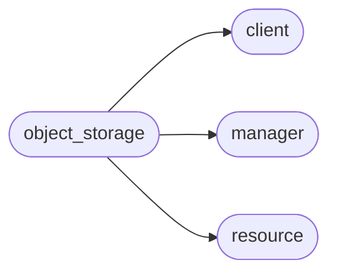

# Pyrax Object Storage

[_Documentation generated by Documatic_](https://www.documatic.com)

<!---Documatic-section-Codebase Structure-start--->
## Codebase Structure

<!---Documatic-block-system_architecture-start--->

<!---Documatic-block-system_architecture-end--->

# #
<!---Documatic-section-Codebase Structure-end--->

<!---Documatic-section-pyrax.object_storage.StorageClient-start--->
## pyrax.object_storage.StorageClient

<!---Documatic-section-StorageClient-start--->
<!---Documatic-block-pyrax.object_storage.StorageClient-start--->
<details>
	<summary><code>pyrax.object_storage.StorageClient</code> code snippet</summary>

```python
class StorageClient(BaseClient):
    name = 'Object Storage'
    folder_upload_status = {}
    bulk_delete_interval = 1

    def __init__(self, *args, **kwargs):
        super(StorageClient, self).__init__(*args, **kwargs)
        self._sync_summary = {'total': 0, 'uploaded': 0, 'ignored': 0, 'older': 0, 'duplicate': 0, 'failed': 0, 'failure_reasons': [], 'deleted': 0}
        self._cached_temp_url_key = None
        self.cdn_management_url = ''
        self.method_dict = {'HEAD': self.method_head, 'GET': self.method_get, 'POST': self.method_post, 'PUT': self.method_put, 'DELETE': self.method_delete, 'PATCH': self.method_patch}
        self._configure_cdn()
        self._backwards_aliases()

    def _configure_cdn(self):
        """
        Initialize CDN-related endpoints, if available.
        """
        ident = self.identity
        cdn_svc = ident.services.get('object_cdn')
        if cdn_svc:
            ep = cdn_svc.endpoints.get(self.region_name)
            if ep:
                self.cdn_management_url = ep.public_url

    def _backwards_aliases(self):
        """
        In order to keep this backwards-compatible with previous versions,
        alias the old names to the new methods.
        """
        self.list_containers = self.list_container_names
        self.get_all_containers = self.list
        self.get_container = self.get
        self.create_container = self.create
        self.delete_container = self.delete
        self.get_container_objects = self.list_container_objects
        self.get_container_object_names = self.list_container_object_names
        self.get_info = self.get_account_info

    def get(self, item):
        """
        Returns the container whose name is provided as 'item'. If 'item' is
        not a string, the original item is returned unchanged.
        """
        if isinstance(item, six.string_types):
            item = super(StorageClient, self).get(item)
        return item

    def _configure_manager(self):
        """
        Creates a manager to handle interacting with Containers.
        """
        self._manager = ContainerManager(self, resource_class=Container, response_key='', uri_base='')

    def remove_container_from_cache(self, container):
        """
        Not used anymore. Included for backwards compatibility.
        """
        pass

    def get_account_details(self):
        """
        Returns a dictionary containing information about the account.
        """
        headers = self._manager.get_account_headers()
        acct_prefix = 'x-account-'
        meta_prefix = ACCOUNT_META_PREFIX.lower()
        ret = {}
        for (hkey, hval) in list(headers.items()):
            lowkey = hkey.lower()
            if lowkey.startswith(acct_prefix):
                if not lowkey.startswith(meta_prefix):
                    cleaned = hkey.replace(acct_prefix, '').replace('-', '_')
                    try:
                        ret[cleaned] = int(hval)
                    except ValueError:
                        ret[cleaned] = hval
        return ret

    def get_account_info(self):
        """
        Returns a tuple for the number of containers and total bytes in the
        account.
        """
        headers = self._manager.get_account_headers()
        return (headers.get('x-account-container-count'), headers.get('x-account-bytes-used'))

    def get_account_metadata(self, prefix=None):
        """
        Returns a dictionary containing metadata about the account.
        """
        return self._manager.get_account_metadata(prefix=prefix)

    def set_account_metadata(self, metadata, clear=False, prefix=None, extra_info=None):
        """
        Accepts a dictionary of metadata key/value pairs and updates the
        account's metadata with them.

        If 'clear' is True, any existing metadata is deleted and only the
        passed metadata is retained. Otherwise, the values passed here update
        the account's metadata.

        By default, the standard account metadata prefix ('X-Account-Meta-') is
        prepended to the header name if it isn't present. For non-standard
        headers, you must include a non-None prefix, such as an empty string.

        The 'extra_info' parameter is included for backwards compatibility. It
        is no longer used at all, and will not be modified with swiftclient
        info, since swiftclient is not used any more.
        """
        return self._manager.set_account_metadata(metadata, clear=clear, prefix=prefix)

    def delete_account_metadata(self, prefix=None):
        """
        Removes all metadata matching the specified prefix from the account.

        By default, the standard account metadata prefix ('X-Account-Meta-') is
        prepended to the header name if it isn't present. For non-standard
        headers, you must include a non-None prefix, such as an empty string.
        """
        return self._manager.delete_account_metadata(prefix=prefix)

    def get_temp_url_key(self, cached=True):
        """
        Returns the current TempURL key, or None if it has not been set.

        By default the value returned is cached. To force an API call to get
        the current value on the server, pass `cached=False`.
        """
        meta = self._cached_temp_url_key
        if not cached or not meta:
            key = 'temp_url_key'
            meta = self.get_account_metadata().get(key)
            self._cached_temp_url_key = meta
        return meta

    def set_temp_url_key(self, key=None):
        """
        Sets the key for the Temporary URL for the account. It should be a key
        that is secret to the owner.

        If no key is provided, a UUID value will be generated and used. It can
        later be obtained by calling get_temp_url_key().
        """
        if key is None:
            key = uuid.uuid4().hex
        meta = {'Temp-Url-Key': key}
        self.set_account_metadata(meta)
        self._cached_temp_url_key = key

    def get_temp_url(self, container, obj, seconds, method='GET', key=None, cached=True):
        """
        Given a storage object in a container, returns a URL that can be used
        to access that object. The URL will expire after `seconds` seconds.

        The only methods supported are GET and PUT. Anything else will raise
        an `InvalidTemporaryURLMethod` exception.

        If you have your Temporary URL key, you can pass it in directly and
        potentially save an API call to retrieve it. If you don't pass in the
        key, and don't wish to use any cached value, pass `cached=False`.
        """
        return self._manager.get_temp_url(container, obj, seconds, method=method, key=key, cached=cached)

    def list(self, limit=None, marker=None, end_marker=None, prefix=None):
        """
        List the containers in this account, using the parameters to control
        the pagination of containers, since by default only the first 10,000
        containers are returned.
        """
        return self._manager.list(limit=limit, marker=marker, end_marker=end_marker, prefix=prefix)

    def list_public_containers(self):
        """
        Returns a list of the names of all CDN-enabled containers.
        """
        return self._manager.list_public_containers()

    def make_container_public(self, container, ttl=None):
        """
        Enables CDN access for the specified container, and optionally sets the
        TTL for the container.
        """
        return self._manager.make_public(container, ttl=ttl)

    def make_container_private(self, container):
        """
        Disables CDN access to a container. It may still appear public until
        its TTL expires.
        """
        return self._manager.make_private(container)

    def get_cdn_log_retention(self, container):
        """
        Returns the status of the setting for CDN log retention for the
        specified container.
        """
        return self._manager.get_cdn_log_retention(container)

    def set_cdn_log_retention(self, container, enabled):
        """
        Enables or disables whether CDN access logs for the specified container
        are collected and stored on Cloud Files.
        """
        return self._manager.set_cdn_log_retention(container, enabled)

    def get_container_streaming_uri(self, container):
        """
        Returns the URI for streaming content, or None if CDN is not enabled.
        """
        return self._manager.get_container_streaming_uri(container)

    def get_container_ios_uri(self, container):
        """
        Returns the iOS URI, or None if CDN is not enabled.
        """
        return self._manager.get_container_ios_uri(container)

    def set_container_web_index_page(self, container, page):
        """
        Sets the header indicating the index page in a container
        when creating a static website.

        Note: the container must be CDN-enabled for this to have
        any effect.
        """
        return self._manager.set_web_index_page(container, page)

    def set_container_web_error_page(self, container, page):
        """
        Sets the header indicating the error page in a container
        when creating a static website.

        Note: the container must be CDN-enabled for this to have
        any effect.
        """
        return self._manager.set_web_error_page(container, page)

    def purge_cdn_object(self, container, obj, email_addresses=None):
        """
        Removes a CDN-enabled object from public access before the TTL expires.
        Please note that there is a limit (at this time) of 25 such requests;
        if you need to purge more than that, you must contact support.

        If one or more email_addresses are included, an email confirming the
        purge is sent to each address.
        """
        return self._manager.purge_cdn_object(container, obj, email_addresses=email_addresses)

    def list_container_names(self):
        """
        Returns a list of the names of the containers in this account.
        """
        return [cont.name for cont in self.list()]

    def list_containers_info(self, limit=None, marker=None):
        """Returns a list of info on Containers.

        For each container, a dict containing the following keys is returned:
        \\code
            name - the name of the container
            count - the number of objects in the container
            bytes - the total bytes in the container
        """
        return self._manager.list_containers_info(limit=limit, marker=marker)

    def list_container_subdirs(self, container, limit=None, marker=None, prefix=None, delimiter=None, full_listing=False):
        """
        Although you cannot nest directories, you can simulate a hierarchical
        structure within a single container by adding forward slash characters
        (/) in the object name. This method returns a list of all of these
        pseudo-subdirectories in the specified container.
        """
        return self._manager.list_subdirs(container, limit=limit, marker=marker, prefix=prefix, delimiter=delimiter, full_listing=full_listing)

    def list_container_object_names(self, container, limit=None, marker=None, prefix=None, delimiter=None, full_listing=False):
        """
        Returns the names of all the objects in the specified container,
        optionally limited by the pagination parameters.
        """
        return self._manager.list_object_names(container, marker=marker, limit=limit, prefix=prefix, delimiter=delimiter, full_listing=full_listing)

    def get_container_metadata(self, container, prefix=None):
        """
        Returns a dictionary containing the metadata for the container.
        """
        return self._manager.get_metadata(container, prefix=prefix)

    def set_container_metadata(self, container, metadata, clear=False, prefix=None):
        """
        Accepts a dictionary of metadata key/value pairs and updates the
        specified container metadata with them.

        If 'clear' is True, any existing metadata is deleted and only the
        passed metadata is retained. Otherwise, the values passed here update
        the container's metadata.

        By default, the standard container metadata prefix
        ('X-Container-Meta-') is prepended to the header name if it isn't
        present. For non-standard headers, you must include a non-None prefix,
        such as an empty string.
        """
        return self._manager.set_metadata(container, metadata, clear=clear, prefix=prefix)

    def remove_container_metadata_key(self, container, key):
        """
        Removes the specified key from the container's metadata. If the key
        does not exist in the metadata, nothing is done.
        """
        return self._manager.remove_metadata_key(container, key)

    def delete_container_metadata(self, container, prefix=None):
        """
        Removes all of thethe container's metadata.

        By default, all metadata beginning with the standard container metadata
        prefix ('X-Container-Meta-') is removed. If you wish to remove all
        metadata beginning with a different prefix, you must specify that
        prefix.
        """
        return self._manager.delete_metadata(container, prefix=prefix)

    def get_container_cdn_metadata(self, container):
        """
        Returns a dictionary containing the CDN metadata for the container.
        """
        return self._manager.get_cdn_metadata(container)

    def set_container_cdn_metadata(self, container, metadata):
        """
        Accepts a dictionary of metadata key/value pairs and updates
        the specified container metadata with them.

        NOTE: arbitrary metadata headers are not allowed. The only metadata
        you can update are: X-Log-Retention, X-CDN-enabled, and X-TTL.
        """
        return self._manager.set_cdn_metadata(container, metadata)

    def get_object_metadata(self, container, obj, prefix=None):
        """
        Returns the metadata for the specified object as a dict.
        """
        return self._manager.get_object_metadata(container, obj, prefix=prefix)

    def set_object_metadata(self, container, obj, metadata, clear=False, extra_info=None, prefix=None):
        """
        Accepts a dictionary of metadata key/value pairs and updates the
        specified object metadata with them.

        If 'clear' is True, any existing metadata is deleted and only the
        passed metadata is retained. Otherwise, the values passed here update
        the object's metadata.

        'extra_info; is an optional dictionary which will be populated with
        'status', 'reason', and 'headers' keys from the underlying swiftclient
        call.

        By default, the standard object metadata prefix ('X-Object-Meta-') is
        prepended to the header name if it isn't present. For non-standard
        headers, you must include a non-None prefix, such as an empty string.
        """
        return self._manager.set_object_metadata(container, obj, metadata, clear=clear, prefix=prefix)

    def remove_object_metadata_key(self, container, obj, key, prefix=None):
        """
        Removes the specified key from the storage object's metadata. If the key
        does not exist in the metadata, nothing is done.
        """
        self.set_object_metadata(container, obj, {key: ''}, prefix=prefix)

    def list_container_objects(self, container, limit=None, marker=None, prefix=None, delimiter=None, end_marker=None, full_listing=False):
        """
        Return a list of StorageObjects representing the objects in the
        container. You can use the marker, end_marker, and limit params to
        handle pagination, and the prefix and delimiter params to filter the
        objects returned.  Also, by default only the first 10,000 objects are
        returned; if you set full_listing to True, an iterator to return all
        the objects in the container is returned. In this case, only the
        'prefix' parameter is used; if you specify any others, they are
        ignored.
        """
        if full_listing:
            return self._manager.object_listing_iterator(container, prefix=prefix)
        return self._manager.list_objects(container, limit=limit, marker=marker, prefix=prefix, delimiter=delimiter, end_marker=end_marker)

    def object_listing_iterator(self, container, prefix=None):
        return self._manager.object_listing_iterator(container, prefix=prefix)

    def delete_object_in_seconds(self, cont, obj, seconds, extra_info=None):
        """
        Sets the object in the specified container to be deleted after the
        specified number of seconds.

        The 'extra_info' parameter is included for backwards compatibility. It
        is no longer used at all, and will not be modified with swiftclient
        info, since swiftclient is not used any more.
        """
        return self._manager.delete_object_in_seconds(cont, obj, seconds)

    def get_object(self, container, obj):
        """
        Returns a StorageObject representing the requested object.
        """
        return self._manager.get_object(container, obj)

    def store_object(self, container, obj_name, data, content_type=None, etag=None, content_encoding=None, ttl=None, return_none=False, chunk_size=None, headers=None, metadata=None, extra_info=None):
        """
        Creates a new object in the specified container, and populates it with
        the given data. A StorageObject reference to the uploaded file
        will be returned, unless 'return_none' is set to True.

        The 'extra_info' parameter is included for backwards compatibility. It
        is no longer used at all, and will not be modified with swiftclient
        info, since swiftclient is not used any more.
        """
        return self.create_object(container, obj_name=obj_name, data=data, content_type=content_type, etag=etag, content_encoding=content_encoding, ttl=ttl, return_none=return_none, chunk_size=chunk_size, headers=headers, metadata=metadata)

    def upload_file(self, container, file_or_path, obj_name=None, content_type=None, etag=None, content_encoding=None, ttl=None, content_length=None, return_none=False, headers=None, metadata=None, extra_info=None):
        """
        Uploads the specified file to the container. If no name is supplied,
        the file's name will be used. Either a file path or an open file-like
        object may be supplied. A StorageObject reference to the uploaded file
        will be returned, unless 'return_none' is set to True.

        You may optionally set the `content_type` and `content_encoding`
        parameters; pyrax will create the appropriate headers when the object
        is stored.

        If the size of the file is known, it can be passed as `content_length`.

        If you wish for the object to be temporary, specify the time it should
        be stored in seconds in the `ttl` parameter. If this is specified, the
        object will be deleted after that number of seconds.

        The 'extra_info' parameter is included for backwards compatibility. It
        is no longer used at all, and will not be modified with swiftclient
        info, since swiftclient is not used any more.
        """
        return self.create_object(container, file_or_path=file_or_path, obj_name=obj_name, content_type=content_type, etag=etag, content_encoding=content_encoding, ttl=ttl, headers=headers, metadata=metadata, return_none=return_none)

    def create_object(self, container, file_or_path=None, data=None, obj_name=None, content_type=None, etag=None, content_encoding=None, content_length=None, ttl=None, chunk_size=None, metadata=None, headers=None, return_none=False):
        """
        Creates or replaces a storage object in the specified container.

        The content of the object can either be a stream of bytes (`data`), or
        a file on disk (`file_or_path`). The disk file can be either an open
        file-like object, or an absolute path to the file on disk.

        When creating object from a data stream, you must specify the name of
        the object to be created in the container via the `obj_name` parameter.
        When working with a file, though, if no `obj_name` value is specified,
        the file`s name will be used.

        You may optionally set the `content_type` and `content_encoding`
        parameters; pyrax will create the appropriate headers when the object
        is stored. If no `content_type` is specified, the object storage system
        will make an intelligent guess based on the content of the object.

        If the size of the file is known, it can be passed as `content_length`.

        If you wish for the object to be temporary, specify the time it should
        be stored in seconds in the `ttl` parameter. If this is specified, the
        object will be deleted after that number of seconds.

        If you wish to store a stream of data (i.e., where you don't know the
        total size in advance), set the `chunk_size` parameter to a non-zero
        value, and omit the `content_length` and `etag` parameters. This allows
        the data to be streamed to the object in the container without having
        to be written to disk first.
        """
        return self._manager.create_object(container, file_or_path=file_or_path, data=data, obj_name=obj_name, content_type=content_type, etag=etag, content_encoding=content_encoding, content_length=content_length, ttl=ttl, chunk_size=chunk_size, metadata=metadata, headers=headers, return_none=return_none)

    def fetch_object(self, container, obj, include_meta=False, chunk_size=None, size=None, extra_info=None):
        """
        Fetches the object from storage.

        If 'include_meta' is False, only the bytes representing the
        stored object are returned.

        Note: if 'chunk_size' is defined, you must fully read the object's
        contents before making another request.

        If 'size' is specified, only the first 'size' bytes of the object will
        be returned. If the object if smaller than 'size', the entire object is
        returned.

        When 'include_meta' is True, what is returned from this method is a
        2-tuple:
            Element 0: a dictionary containing metadata about the file.
            Element 1: a stream of bytes representing the object's contents.

        The 'extra_info' parameter is included for backwards compatibility. It
        is no longer used at all, and will not be modified with swiftclient
        info, since swiftclient is not used any more.
        """
        return self._manager.fetch_object(container, obj, include_meta=include_meta, chunk_size=chunk_size, size=size)

    def fetch_partial(self, container, obj, size):
        """
        Returns the first 'size' bytes of an object. If the object is smaller
        than the specified 'size' value, the entire object is returned.
        """
        return self._manager.fetch_partial(container, obj, size)

    def fetch_dlo(self, container, name, chunk_size=None, verbose=False):
        """
        Returns a list of 2-tuples in the form of (object_name,
        fetch_generator) representing the components of a multi-part DLO
        (Dynamic Large Object).  Each fetch_generator object can be interated
        to retrieve its contents.

        This is useful when transferring a DLO from one object storage system
        to another. Examples would be copying DLOs from one region of a
        provider to another, or copying a DLO from one provider to another.
        """
        if chunk_size is None:
            chunk_size = DEFAULT_CHUNKSIZE

        class FetchChunker(object):
            """
            Class that takes the generator objects returned by a chunked
            fetch_object() call and wraps them to behave as file-like objects
            for uploading.
            """

            def __init__(self, gen, verbose=False):
                self.gen = gen
                self.verbose = verbose
                self.processed = 0
                self.count = 0
                self.interval = 100

            def read(self, size=None):
                self.count += 1
                if self.verbose:
                    if self.count > self.interval:
                        self.count = 0
                        print('.')
                ret = next(self.gen)
                self.processed += len(ret)
                return ret
        parts = self.get_container_objects(container, prefix=name)
        fetches = [(part.name, self.fetch_object(container, part.name, chunk_size=chunk_size)) for part in parts if part.name != name]
        job = [(fetch[0], FetchChunker(fetch[1], verbose=verbose)) for fetch in fetches]
        return job

    def download_object(self, container, obj, directory, structure=True):
        """
        Fetches the object from storage, and writes it to the specified
        directory. The directory must exist before calling this method.

        If the object name represents a nested folder structure, such as
        "foo/bar/baz.txt", that folder structure will be created in the target
        directory by default. If you do not want the nested folders to be
        created, pass `structure=False` in the parameters.
        """
        return self._manager.download_object(container, obj, directory, structure=structure)

    def delete(self, container, del_objects=False):
        """
        Deletes the specified container. If the container contains objects, the
        command will fail unless 'del_objects' is passed as True. In that case,
        each object will be deleted first, and then the container.
        """
        return self._manager.delete(container, del_objects=del_objects)

    def delete_object(self, container, obj):
        """
        Deletes the object from the specified container.

        The 'obj' parameter can either be the name of the object, or a
        StorageObject representing the object to be deleted.
        """
        return self._manager.delete_object(container, obj)

    def copy_object(self, container, obj, new_container, new_obj_name=None, content_type=None, extra_info=None):
        """
        Copies the object to the new container, optionally giving it a new name.
        If you copy to the same container, you must supply a different name.

        You can optionally change the content_type of the object by supplying
        that in the 'content_type' parameter.

        The 'extra_info' parameter is included for backwards compatibility. It
        is no longer used at all, and will not be modified with swiftclient
        info, since swiftclient is not used any more.
        """
        return self._manager.copy_object(container, obj, new_container, new_obj_name=new_obj_name, content_type=content_type)

    def move_object(self, container, obj, new_container, new_obj_name=None, new_reference=False, content_type=None, extra_info=None):
        """
        Works just like copy_object, except that the source object is deleted
        after a successful copy.

        You can optionally change the content_type of the object by supplying
        that in the 'content_type' parameter.

        NOTE: any references to the original object will no longer be valid;
        you will have to get a reference to the new object by passing True for
        the 'new_reference' parameter. When this is True, a reference to the
        newly moved object is returned. Otherwise, the etag for the moved
        object is returned.

        The 'extra_info' parameter is included for backwards compatibility. It
        is no longer used at all, and will not be modified with swiftclient
        info, since swiftclient is not used any more.
        """
        return self._manager.move_object(container, obj, new_container, new_obj_name=new_obj_name, new_reference=new_reference, content_type=content_type)

    def change_object_content_type(self, container, obj, new_ctype, guess=False, extra_info=None):
        """
        Copies object to itself, but applies a new content-type. The guess
        feature requires the container to be CDN-enabled. If not then the
        content-type must be supplied. If using guess with a CDN-enabled
        container, new_ctype can be set to None. Failure during the put will
        result in a swift exception.

        The 'extra_info' parameter is included for backwards compatibility. It
        is no longer used at all, and will not be modified with swiftclient
        info, since swiftclient is not used any more.
        """
        return self._manager.change_object_content_type(container, obj, new_ctype, guess=guess)

    def upload_folder(self, folder_path, container=None, ignore=None, ttl=None):
        """
        Convenience method for uploading an entire folder, including any
        sub-folders, to Cloud Files.

        All files will be uploaded to objects with the same name as the file.
        In the case of nested folders, files will be named with the full path
        relative to the base folder. E.g., if the folder you specify contains a
        folder named 'docs', and 'docs' contains a file named 'install.html',
        that file will be uploaded to an object named 'docs/install.html'.

        If 'container' is specified, the folder's contents will be uploaded to
        that container. If it is not specified, a new container with the same
        name as the specified folder will be created, and the files uploaded to
        this new container.

        You can selectively ignore files by passing either a single pattern or
        a list of patterns; these will be applied to the individual folder and
        file names, and any names that match any of the 'ignore' patterns will
        not be uploaded. The patterns should be standard *nix-style shell
        patterns; e.g., '*pyc' will ignore all files ending in 'pyc', such as
        'program.pyc' and 'abcpyc'.

        The upload will happen asynchronously; in other words, the call to
        upload_folder() will generate a UUID and return a 2-tuple of (UUID,
        total_bytes) immediately. Uploading will happen in the background; your
        app can call get_uploaded(uuid) to get the current status of the
        upload. When the upload is complete, the value returned by
        get_uploaded(uuid) will match the total_bytes for the upload.

        If you start an upload and need to cancel it, call
        cancel_folder_upload(uuid), passing the uuid returned by the initial
        call.  It will then be up to you to either keep or delete the
        partially-uploaded content.

        If you specify a `ttl` parameter, the uploaded files will be deleted
        after that number of seconds.
        """
        if not os.path.isdir(folder_path):
            raise exc.FolderNotFound("No such folder: '%s'" % folder_path)
        ignore = utils.coerce_to_list(ignore)
        total_bytes = utils.folder_size(folder_path, ignore)
        upload_key = str(uuid.uuid4())
        self.folder_upload_status[upload_key] = {'continue': True, 'total_bytes': total_bytes, 'uploaded': 0}
        self._upload_folder_in_background(folder_path, container, ignore, upload_key, ttl)
        return (upload_key, total_bytes)

    def _upload_folder_in_background(self, folder_path, container, ignore, upload_key, ttl=None):
        """Runs the folder upload in the background."""
        uploader = FolderUploader(folder_path, container, ignore, upload_key, self, ttl=ttl)
        uploader.start()

    def sync_folder_to_container(self, folder_path, container, delete=False, include_hidden=False, ignore=None, ignore_timestamps=False, object_prefix='', verbose=False):
        """
        Compares the contents of the specified folder, and checks to make sure
        that the corresponding object is present in the specified container. If
        there is no remote object matching the local file, it is created. If a
        matching object exists, the etag is examined to determine if the object
        in the container matches the local file; if they differ, the container
        is updated with the local file if the local file is newer when
        `ignore_timestamps' is False (default). If `ignore_timestamps` is True,
        the object is overwritten with the local file contents whenever the
        etags differ. NOTE: the timestamp of a remote object is the time it was
        uploaded, not the original modification time of the file stored in that
        object.  Unless 'include_hidden' is True, files beginning with an
        initial period are ignored.

        If the 'delete' option is True, any objects in the container that do
        not have corresponding files in the local folder are deleted.

        You can selectively ignore files by passing either a single pattern or
        a list of patterns; these will be applied to the individual folder and
        file names, and any names that match any of the 'ignore' patterns will
        not be uploaded. The patterns should be standard *nix-style shell
        patterns; e.g., '*pyc' will ignore all files ending in 'pyc', such as
        'program.pyc' and 'abcpyc'.

        If `object_prefix` is set it will be appended to the object name when
        it is checked and uploaded to the container. For example, if you use
        sync_folder_to_container("folderToSync/", myContainer,
            object_prefix="imgFolder") it will upload the files to the
        container/imgFolder/... instead of just container/...

        Set `verbose` to True to make it print what is going on. It will
        show which files are being uploaded and which ones are not and why.
        """
        cont = self.get_container(container)
        self._local_files = []
        if verbose:
            log = logging.getLogger('pyrax')
            log.info('Loading remote object list (prefix=%s)', object_prefix)
        data = cont.get_objects(prefix=object_prefix, full_listing=True)
        self._remote_files = dict(((d.name, d) for d in data))
        self._sync_summary = {'total': 0, 'uploaded': 0, 'ignored': 0, 'older': 0, 'duplicate': 0, 'failed': 0, 'failure_reasons': [], 'deleted': 0}
        self._sync_folder_to_container(folder_path, cont, prefix='', delete=delete, include_hidden=include_hidden, ignore=ignore, ignore_timestamps=ignore_timestamps, object_prefix=object_prefix, verbose=verbose)
        self._remote_files = None
        if verbose:
            summary = self._sync_summary
            log.info('Folder sync completed at %s' % time.ctime())
            log.info('  Total files processed: %s' % summary['total'])
            log.info('  Number Uploaded: %s' % summary['uploaded'])
            log.info('  Number Ignored: %s' % summary['ignored'])
            log.info('  Number Skipped (older): %s' % summary['older'])
            log.info('  Number Skipped (dupe): %s' % summary['duplicate'])
            log.info('  Number Deleted: %s' % summary['deleted'])
            log.info('  Number Failed: %s' % summary['failed'])
            if summary['failed']:
                for reason in summary['failure_reasons']:
                    log.info('  Reason: %s' % reason)

    def _sync_folder_to_container(self, folder_path, container, prefix, delete, include_hidden, ignore, ignore_timestamps, object_prefix, verbose):
        """
        This is the internal method that is called recursively to handle
        nested folder structures.
        """
        fnames = os.listdir(folder_path)
        ignore = utils.coerce_to_list(ignore)
        log = logging.getLogger('pyrax')
        if not include_hidden:
            ignore.append('.*')
        for fname in fnames:
            if utils.match_pattern(fname, ignore):
                self._sync_summary['ignored'] += 1
                continue
            pth = os.path.join(folder_path, fname)
            if os.path.isdir(pth):
                subprefix = fname
                if prefix:
                    subprefix = os.path.join(prefix, subprefix)
                self._sync_folder_to_container(pth, container, prefix=subprefix, delete=delete, include_hidden=include_hidden, ignore=ignore, ignore_timestamps=ignore_timestamps, object_prefix=object_prefix, verbose=verbose)
                continue
            self._local_files.append(os.path.join(object_prefix, prefix, fname))
            local_etag = utils.get_checksum(pth)
            if object_prefix:
                prefix = os.path.join(object_prefix, prefix)
                object_prefix = ''
            fullname_with_prefix = os.path.join(prefix, fname)
            try:
                obj = self._remote_files[fullname_with_prefix]
                obj_etag = obj.etag
            except KeyError:
                obj = None
                obj_etag = None
            if local_etag != obj_etag:
                if not ignore_timestamps:
                    if obj:
                        obj_time_str = obj.last_modified[:19]
                    else:
                        obj_time_str = EARLY_DATE_STR
                    local_mod = datetime.datetime.utcfromtimestamp(os.stat(pth).st_mtime)
                    local_mod_str = local_mod.isoformat()
                    if obj_time_str >= local_mod_str:
                        self._sync_summary['older'] += 1
                        if verbose:
                            log.info('%s NOT UPLOADED because remote object is newer', fullname_with_prefix)
                            log.info('  Local: %s   Remote: %s' % (local_mod_str, obj_time_str))
                        continue
                try:
                    container.upload_file(pth, obj_name=fullname_with_prefix, etag=local_etag, return_none=True)
                    self._sync_summary['uploaded'] += 1
                    if verbose:
                        log.info('%s UPLOADED', fullname_with_prefix)
                except Exception as e:
                    self._sync_summary['failed'] += 1
                    self._sync_summary['failure_reasons'].append('%s' % e)
                    if verbose:
                        log.error('%s UPLOAD FAILED. Exception: %s' % (fullname_with_prefix, e))
            else:
                self._sync_summary['duplicate'] += 1
                if verbose:
                    log.info('%s NOT UPLOADED because it already exists', fullname_with_prefix)
        if delete and (not prefix):
            self._delete_objects_not_in_list(container, object_prefix)

    def _delete_objects_not_in_list(self, cont, object_prefix=''):
        """
        Finds all the objects in the specified container that are not present
        in the self._local_files list, and deletes them.
        """
        objnames = set(cont.get_object_names(prefix=object_prefix, full_listing=True))
        localnames = set(self._local_files)
        to_delete = list(objnames.difference(localnames))
        self._sync_summary['deleted'] += len(to_delete)
        self._thread = self.bulk_delete(cont, to_delete, async_=True)

    def bulk_delete(self, container, object_names, async_=False):
        """
        Deletes multiple objects from a container in a single call.

        The bulk deletion call does not return until all of the specified
        objects have been processed. For large numbers of objects, this can
        take quite a while, so there is an 'async_' parameter to give you the
        option to have this call return immediately. If 'async_' is True, an
        object is returned with a 'completed' attribute that will be set to
        True as soon as the bulk deletion is complete, and a 'results'
        attribute that will contain a dictionary (described below) with the
        results of the bulk deletion.

        When deletion is complete the bulk deletion object's 'results'
        attribute will be populated with the information returned from the API
        call. In synchronous mode this is the value that is returned when the
        call completes. It is a dictionary with the following keys:

            deleted - the number of objects deleted
            not_found - the number of objects not found
            status - the HTTP return status code. '200 OK' indicates success
            errors - a list of any errors returned by the bulk delete call

        This isn't available in swiftclient yet, so it's using code patterned
        after the client code in that library.
        """
        deleter = BulkDeleter(self, container, object_names)
        deleter.start()
        if async_:
            return deleter
        while not deleter.completed:
            time.sleep(self.bulk_delete_interval)
        return deleter.results

    def cdn_request(self, uri, method, *args, **kwargs):
        """
        If the service supports CDN, use this method to access CDN-specific
        URIs.
        """
        if not self.cdn_management_url:
            raise exc.NotCDNEnabled('CDN is not enabled for this service.')
        cdn_uri = '%s%s' % (self.cdn_management_url, uri)
        mthd = self.method_dict.get(method.upper())
        try:
            (resp, resp_body) = mthd(cdn_uri, *args, **kwargs)
        except exc.NotFound as e:
            try:
                mgt_uri = '%s%s' % (self.management_url, uri)
                (resp, resp_body) = self.method_head(mgt_uri)
            except exc.NotFound:
                raise
            raise exc.NotCDNEnabled('This container is not CDN-enabled.')
        return (resp, resp_body)

    @_valid_upload_key
    def _update_progress(self, upload_key, size):
        self.folder_upload_status[upload_key]['uploaded'] += size

    @_valid_upload_key
    def get_uploaded(self, upload_key):
        """Returns the number of bytes uploaded for the specified process."""
        return self.folder_upload_status[upload_key]['uploaded']

    @_valid_upload_key
    def cancel_folder_upload(self, upload_key):
        """
        Cancels any folder upload happening in the background. If there is no
        such upload in progress, calling this method has no effect.
        """
        self.folder_upload_status[upload_key]['continue'] = False

    @_valid_upload_key
    def _should_abort_folder_upload(self, upload_key):
        """
        Returns True if the user has canceled upload; returns False otherwise.
        """
        return not self.folder_upload_status[upload_key]['continue']
```
</details>
<!---Documatic-block-pyrax.object_storage.StorageClient-end--->
<!---Documatic-section-StorageClient-end--->

# #
<!---Documatic-section-pyrax.object_storage.StorageClient-end--->

[_Documentation generated by Documatic_](https://www.documatic.com)