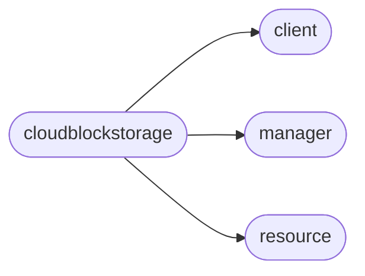

# Pyrax Cloudblockstorage

[_Documentation generated by Documatic_](https://www.documatic.com)

<!---Documatic-section-Codebase Structure-start--->
## Codebase Structure

<!---Documatic-block-system_architecture-start--->

<!---Documatic-block-system_architecture-end--->

# #
<!---Documatic-section-Codebase Structure-end--->

<!---Documatic-section-pyrax.cloudblockstorage.CloudBlockStorageClient-start--->
## [pyrax.cloudblockstorage.CloudBlockStorageClient](4-pyrax_cloudblockstorage.md#pyrax.cloudblockstorage.CloudBlockStorageClient)

<!---Documatic-section-CloudBlockStorageClient-start--->
<!---Documatic-block-pyrax.cloudblockstorage.CloudBlockStorageClient-start--->
<details>
	<summary><code>pyrax.cloudblockstorage.CloudBlockStorageClient</code> code snippet</summary>

```python
class CloudBlockStorageClient(BaseClient):
    name = 'Cloud Block Storage'

    def _configure_manager(self):
        """
        Create the manager to handle the instances, and also another
        to handle flavors.
        """
        self._manager = CloudBlockStorageManager(self, resource_class=CloudBlockStorageVolume, response_key='volume', uri_base='volumes')
        self._types_manager = BaseManager(self, resource_class=CloudBlockStorageVolumeType, response_key='volume_type', uri_base='types')
        self._snapshot_manager = CloudBlockStorageSnapshotManager(self, resource_class=CloudBlockStorageSnapshot, response_key='snapshot', uri_base='snapshots')

    def list_types(self):
        """Returns a list of all available volume types."""
        return self._types_manager.list()

    def list_snapshots(self):
        """Returns a list of all snapshots."""
        return self._snapshot_manager.list()

    @assure_volume
    def attach_to_instance(self, volume, instance, mountpoint):
        """Attaches the volume to the specified instance at the mountpoint."""
        return volume.attach_to_instance(instance, mountpoint)

    @assure_volume
    def detach(self, volume):
        """Detaches the volume from whatever device it is attached to."""
        return volume.detach()

    @assure_volume
    def delete_volume(self, volume, force=False):
        """Deletes the volume."""
        return volume.delete(force=force)

    @assure_volume
    def update(self, volume, display_name=None, display_description=None):
        """
        Update the specified values on the specified volume. You may specify
        one or more values to update. If no values are specified as non-None,
        the call is a no-op; no exception will be raised.
        """
        return volume.update(display_name=display_name, display_description=display_description)

    def rename(self, volume, name):
        """
        Allows for direct renaming of an existing volume.
        """
        return self.update(volume, display_name=name)

    @assure_volume
    def create_snapshot(self, volume, name=None, description=None, force=False):
        """
        Creates a snapshot of the volume, with an optional name and description.

        Normally snapshots will not happen if the volume is attached. To
        override this default behavior, pass force=True.
        """
        return self._snapshot_manager.create(volume=volume, name=name, description=description, force=force)

    def get_snapshot(self, snapshot):
        """
        Returns the snapshot with the specified snapshot ID value.
        """
        return self._snapshot_manager.get(snapshot)

    @assure_snapshot
    def delete_snapshot(self, snapshot):
        """Deletes the snapshot."""
        return snapshot.delete()

    @assure_snapshot
    def update_snapshot(self, snapshot, display_name=None, display_description=None):
        """
        Update the specified values on the specified snapshot. You may specify
        one or more values to update.
        """
        return snapshot.update(display_name=display_name, display_description=display_description)

    def rename_snapshot(self, snapshot, name):
        """
        Allows for direct renaming of an existing snapshot.
        """
        return self.update_snapshot(snapshot, display_name=name)
```
</details>
<!---Documatic-block-pyrax.cloudblockstorage.CloudBlockStorageClient-end--->
<!---Documatic-section-CloudBlockStorageClient-end--->

# #
<!---Documatic-section-pyrax.cloudblockstorage.CloudBlockStorageClient-end--->

[_Documentation generated by Documatic_](https://www.documatic.com)