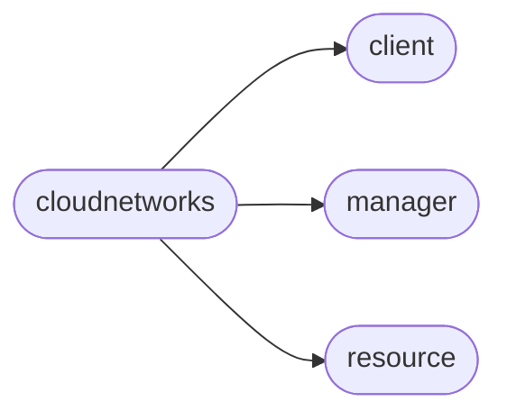

# Pyrax Cloudnetworks

[_Documentation generated by Documatic_](https://www.documatic.com)

<!---Documatic-section-Codebase Structure-start--->
## Codebase Structure

<!---Documatic-block-system_architecture-start--->

<!---Documatic-block-system_architecture-end--->

# #
<!---Documatic-section-Codebase Structure-end--->

<!---Documatic-section-pyrax.cloudnetworks.CloudNetworkClient-start--->
## [pyrax.cloudnetworks.CloudNetworkClient](5-pyrax_cloudnetworks.md#pyrax.cloudnetworks.CloudNetworkClient)

<!---Documatic-section-CloudNetworkClient-start--->
<!---Documatic-block-pyrax.cloudnetworks.CloudNetworkClient-start--->
<details>
	<summary><code>pyrax.cloudnetworks.CloudNetworkClient</code> code snippet</summary>

```python
class CloudNetworkClient(BaseClient):

    def __init__(self, *args, **kwargs):
        super(CloudNetworkClient, self).__init__(*args, **kwargs)
        self.name = 'Cloud Networks'
        self.PUBLIC_NET_ID = PUBLIC_NET_ID
        self.SERVICE_NET_ID = SERVICE_NET_ID
        self.PSEUDO_NETWORKS = PSEUDO_NETWORKS

    def _configure_manager(self):
        """
        Creates the Manager instance to handle networks.
        """
        self._manager = CloudNetworkManager(self, resource_class=CloudNetwork, response_key='network', uri_base='os-networksv2')

    def create(self, label=None, name=None, cidr=None):
        """
        Wraps the basic create() call to handle specific failures.
        """
        try:
            return super(CloudNetworkClient, self).create(label=label, name=name, cidr=cidr)
        except exc.BadRequest as e:
            msg = e.message
            if 'too many networks' in msg:
                raise exc.NetworkCountExceeded('Cannot create network; the maximum number of isolated networks already exist.')
            elif 'does not contain enough' in msg:
                raise exc.NetworkCIDRInvalid("Networks must contain two or more hosts; the CIDR '%s' is too restrictive." % cidr)
            elif 'CIDR is malformed' in msg:
                raise exc.NetworkCIDRMalformed("The CIDR '%s' is not valid." % cidr)
            else:
                raise

    def delete(self, network):
        """
        Wraps the standard delete() method to catch expected exceptions and
        raise the appropriate pyrax exceptions.
        """
        try:
            return super(CloudNetworkClient, self).delete(network)
        except exc.Forbidden as e:
            raise exc.NetworkInUse('Cannot delete a network in use by a server.')

    def find_network_by_label(self, label):
        """
        This is inefficient; it gets all the networks and then filters on
        the client side to find the matching name.
        """
        networks = self.list()
        match = [network for network in networks if network.label == label]
        if not match:
            raise exc.NetworkNotFound("No network with the label '%s' exists" % label)
        elif len(match) > 1:
            raise exc.NetworkLabelNotUnique("There were %s matches for the label '%s'." % (len(match), label))
        return match[0]
    find_network_by_name = find_network_by_label

    def get_server_networks(self, network, public=False, private=False, key=None):
        """
        Creates the dict of network UUIDs required by Cloud Servers when
        creating a new server with isolated networks. By default, the UUID
        values are returned with the key of "net-id", which is what novaclient
        expects. Other tools may require different values, such as 'uuid'. If
        that is the case, pass the desired key as the 'key' parameter.

        By default only this network is included. If you wish to create a
        server that has either the public (internet) or private (ServiceNet)
        networks, you have to pass those parameters in with values of True.
        """
        return _get_server_networks(network, public=public, private=private, key=key)
```
</details>
<!---Documatic-block-pyrax.cloudnetworks.CloudNetworkClient-end--->
<!---Documatic-section-CloudNetworkClient-end--->

# #
<!---Documatic-section-pyrax.cloudnetworks.CloudNetworkClient-end--->

[_Documentation generated by Documatic_](https://www.documatic.com)