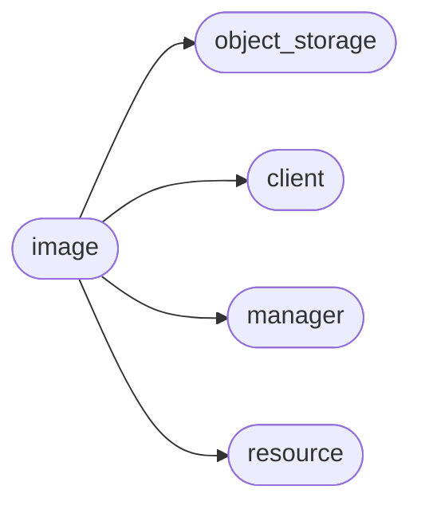

# Pyrax Image

[_Documentation generated by Documatic_](https://www.documatic.com)

<!---Documatic-section-Codebase Structure-start--->
## Codebase Structure

<!---Documatic-block-system_architecture-start--->

<!---Documatic-block-system_architecture-end--->

# #
<!---Documatic-section-Codebase Structure-end--->

<!---Documatic-section-pyrax.image.ImageClient-start--->
## [pyrax.image.ImageClient](6-pyrax_image.md#pyrax.image.ImageClient)

<!---Documatic-section-ImageClient-start--->
<!---Documatic-block-pyrax.image.ImageClient-start--->
<details>
	<summary><code>pyrax.image.ImageClient</code> code snippet</summary>

```python
class ImageClient(BaseClient):
    name = 'Images'

    def _configure_manager(self):
        """
        Create the manager to handle queues.
        """
        self._manager = ImageManager(self, resource_class=Image, response_key='', plural_response_key='images', uri_base='images')
        self._tasks_manager = ImageTasksManager(self, resource_class=ImageTask, response_key='', plural_response_key='tasks', uri_base='tasks')
        self._schema_manager = JSONSchemaManager(self, resource_class=None, response_key='', plural_response_key='', uri_base='schemas')

    def list(self, limit=None, marker=None, name=None, visibility=None, member_status=None, owner=None, tag=None, status=None, size_min=None, size_max=None, sort_key=None, sort_dir=None):
        """
        Returns a list of resource objects. Pagination is supported through the
        optional 'marker' and 'limit' parameters. Filtering the returned value
        is possible by specifying values for any of the other parameters.
        """
        return self._manager.list(limit=limit, marker=marker, name=name, visibility=visibility, member_status=member_status, owner=owner, tag=tag, status=status, size_min=size_min, size_max=size_max, sort_key=sort_key, sort_dir=sort_dir)

    def list_all(self, name=None, visibility=None, member_status=None, owner=None, tag=None, status=None, size_min=None, size_max=None, sort_key=None, sort_dir=None):
        """
        Returns all of the images in one call, rather than in paginated batches.
        The same filtering options available in list() apply here, with the
        obvious exception of limit and marker.
        """
        return self._manager.list_all(name=name, visibility=visibility, member_status=member_status, owner=owner, tag=tag, status=status, size_min=size_min, size_max=size_max, sort_key=sort_key, sort_dir=sort_dir)

    def update(self, img, value_dict):
        """
        Accepts an image reference (object or ID) and  dictionary of key/value
        pairs, where the key is an attribute of the image, and the value is the
        desired new value for that image.
        """
        return self._manager.update(img, value_dict)

    def create(self, name, img_format=None, data=None, container=None, obj=None, metadata=None):
        """
        Creates a new image with the specified name. The image data can either
        be supplied directly in the 'data' parameter, or it can be an image
        stored in the object storage service. In the case of the latter, you
        can either supply the container and object names, or simply a
        StorageObject reference.
        """
        return self._manager.create(name, img_format, data=data, container=container, obj=obj)

    def change_image_name(self, img, newname):
        """
        Image name can be changed via the update() method. This is simply a
        convenience method.
        """
        return self.update(img, {'name': newname})

    @assure_image
    def list_image_members(self, img):
        """
        Returns a list of members (users) of the specified image.
        """
        return img.list_members()

    @assure_image
    def get_image_member(self, img, member):
        """
        Returns the ImageMember object representing the specified member for the
        specified image.
        """
        return img.get_member(member)

    @assure_image
    def add_image_member(self, img, project_id):
        """
        Adds the project (tenant) represented by the project_id as a member of
        the specified image.
        """
        return img.add_member(project_id)

    @assure_image
    def delete_image_member(self, img, project_id):
        """
        Removes the project (tenant) represented by the project_id as a member
        of the specified image.
        """
        return img.delete_member(project_id)

    def update_image_member(self, img_id, status):
        """
        Updates the image whose ID is given with the status specified. This
        must be called by the user whose project_id is in the members for the
        image; that is, the user with whom the image is being shared. If called
        by the owner of the image, an `InvalidImageMember` exception will be
        raised.

        Valid values for 'status' include:
            pending
            accepted
            rejected

        Any other value will result in an `InvalidImageMemberStatus` exception
        being raised.
        """
        return self._manager.update_image_member(img_id, status)

    @assure_image
    def add_image_tag(self, img, tag):
        """
        Adds the tag to the specified image.
        """
        return img.add_tag(tag)

    @assure_image
    def delete_image_tag(self, img, tag):
        """
        Deletes the tag from the specified image.
        """
        return img.delete_tag(tag)

    def list_tasks(self):
        """
        Returns a list of all tasks.
        """
        return self._tasks_manager.list()

    def get_task(self, task):
        """
        Returns the ImageTask object for the supplied ID.
        """
        return self._tasks_manager.get(task)

    def export_task(self, img, cont):
        """
        Creates a task to export the specified image to the swift container
        named in the 'cont' parameter. If the container does not exist, a
        NoSuchContainer exception is raised.

        The 'img' parameter can be either an Image object or the ID of an
        image. If these do not correspond to a valid image, a NotFound
        exception is raised.
        """
        return self._tasks_manager.create('export', img=img, cont=cont)

    def import_task(self, img, cont, img_format=None, img_name=None):
        """
        Creates a task to import the specified image from the swift container
        named in the 'cont' parameter. The new image will be named the same as
        the object in the container unless you specify a value for the
        'img_name' parameter.

        By default it is assumed that the image is in 'vhd' format; if it is
        another format, you must specify that in the 'img_format' parameter.
        """
        return self._tasks_manager.create('import', img=img, cont=cont, img_format=img_format, img_name=img_name)

    def get_images_schema(self):
        """
        Returns a json-schema document that represents an image members entity,
        which is a container of image member entities.
        """
        return self._schema_manager.images()

    def get_image_schema(self):
        """
        Returns a json-schema document that represents a single image entity.
        """
        return self._schema_manager.image()

    def get_image_members_schema(self):
        """
        Returns a json-schema document that represents an image members entity
        (a container of member entities).
        """
        return self._schema_manager.image_members()

    def get_image_member_schema(self):
        """
        Returns a json-schema document that represents an image member entity.
        (a container of member entities).
        """
        return self._schema_manager.image_member()

    def get_image_tasks_schema(self):
        """
        Returns a json-schema document that represents a container of tasks
        entities.
        """
        return self._schema_manager.image_tasks()

    def get_image_task_schema(self):
        """
        Returns a json-schema document that represents an task entity.
        """
        return self._schema_manager.image_task()
```
</details>
<!---Documatic-block-pyrax.image.ImageClient-end--->
<!---Documatic-section-ImageClient-end--->

# #
<!---Documatic-section-pyrax.image.ImageClient-end--->

[_Documentation generated by Documatic_](https://www.documatic.com)