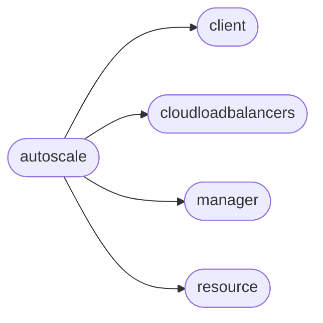

# Pyrax Autoscale

[_Documentation generated by Documatic_](https://www.documatic.com)

<!---Documatic-section-Codebase Structure-start--->
## Codebase Structure

<!---Documatic-block-system_architecture-start--->

<!---Documatic-block-system_architecture-end--->

# #
<!---Documatic-section-Codebase Structure-end--->

<!---Documatic-section-pyrax.autoscale.AutoScaleClient-start--->
## [pyrax.autoscale.AutoScaleClient](7-pyrax_autoscale.md#pyrax.autoscale.AutoScaleClient)

<!---Documatic-section-AutoScaleClient-start--->
<!---Documatic-block-pyrax.autoscale.AutoScaleClient-start--->
<details>
	<summary><code>pyrax.autoscale.AutoScaleClient</code> code snippet</summary>

```python
class AutoScaleClient(BaseClient):
    name = 'Autoscale'

    def _configure_manager(self):
        """
        Creates a manager to handle autoscale operations.
        """
        self._manager = ScalingGroupManager(self, resource_class=ScalingGroup, response_key='group', uri_base='groups')

    def get_state(self, scaling_group):
        """
        Returns the current state of the specified scaling group.
        """
        return self._manager.get_state(scaling_group)

    def pause(self, scaling_group):
        """
        Pauses all execution of the policies for the specified scaling group.
        """
        return self._manager.pause(scaling_group)

    def resume(self, scaling_group):
        """
        Resumes execution of the policies for the specified scaling group.
        """
        return self._manager.resume(scaling_group)

    def replace(self, scaling_group, name, cooldown, min_entities, max_entities, metadata=None):
        """
        Replace an existing ScalingGroup configuration. All of the attributes
        must be specified. If you wish to delete any of the optional
        attributes, pass them in as None.
        """
        return self._manager.replace(scaling_group, name, cooldown, min_entities, max_entities, metadata=metadata)

    def update(self, scaling_group, name=None, cooldown=None, min_entities=None, max_entities=None, metadata=None):
        """
        Updates an existing ScalingGroup. One or more of the attributes can be
        specified.

        NOTE: if you specify metadata, it will *replace* any existing metadata.
        If you want to add to it, you either need to pass the complete dict of
        metadata, or call the update_metadata() method.
        """
        return self._manager.update(scaling_group, name=name, cooldown=cooldown, min_entities=min_entities, max_entities=max_entities, metadata=metadata)

    def update_metadata(self, scaling_group, metadata):
        """
        Adds the given metadata dict to the existing metadata for the scaling
        group.
        """
        return self._manager.update_metadata(scaling_group, metadata)

    def get_configuration(self, scaling_group):
        """
        Returns the scaling group's configuration in a dictionary.
        """
        return self._manager.get_configuration(scaling_group)

    def get_launch_config(self, scaling_group):
        """
        Returns the launch configuration for the specified scaling group.
        """
        return self._manager.get_launch_config(scaling_group)

    def replace_launch_config(self, scaling_group, launch_config_type, server_name, image, flavor, disk_config=None, metadata=None, personality=None, networks=None, load_balancers=None, key_name=None):
        """
        Replace an existing launch configuration. All of the attributes must be
        specified. If you wish to delete any of the optional attributes, pass
        them in as None.
        """
        return self._manager.replace_launch_config(scaling_group, launch_config_type, server_name, image, flavor, disk_config=disk_config, metadata=metadata, personality=personality, networks=networks, load_balancers=load_balancers, key_name=key_name)

    def update_launch_config(self, scaling_group, server_name=None, image=None, flavor=None, disk_config=None, metadata=None, personality=None, networks=None, load_balancers=None, key_name=None, config_drive=False, user_data=None):
        """
        Updates the server launch configuration for an existing scaling group.
        One or more of the available attributes can be specified.

        NOTE: if you specify metadata, it will *replace* any existing metadata.
        If you want to add to it, you either need to pass the complete dict of
        metadata, or call the update_launch_metadata() method.
        """
        return self._manager.update_launch_config(scaling_group, server_name=server_name, image=image, flavor=flavor, disk_config=disk_config, metadata=metadata, personality=personality, networks=networks, load_balancers=load_balancers, key_name=key_name, config_drive=config_drive, user_data=user_data)

    def update_launch_metadata(self, scaling_group, metadata):
        """
        Adds the given metadata dict to the existing metadata for the scaling
        group's launch configuration.
        """
        return self._manager.update_launch_metadata(scaling_group, metadata)

    def add_policy(self, scaling_group, name, policy_type, cooldown, change=None, is_percent=False, desired_capacity=None, args=None):
        """
        Adds a policy with the given values to the specified scaling group. The
        'change' parameter is treated as an absolute amount, unless
        'is_percent' is True, in which case it is treated as a percentage.
        """
        return self._manager.add_policy(scaling_group, name, policy_type, cooldown, change=change, is_percent=is_percent, desired_capacity=desired_capacity, args=args)

    def list_policies(self, scaling_group):
        """
        Returns a list of all policies defined for the specified scaling group.
        """
        return self._manager.list_policies(scaling_group)

    def get_policy(self, scaling_group, policy):
        """
        Gets the detail for the specified policy.
        """
        return self._manager.get_policy(scaling_group, policy)

    def replace_policy(self, scaling_group, policy, name, policy_type, cooldown, change=None, is_percent=False, desired_capacity=None, args=None):
        """
        Replace an existing policy. All of the attributes must be specified. If
        you wish to delete any of the optional attributes, pass them in as
        None.
        """
        return self._manager.replace_policy(scaling_group, policy, name, policy_type, cooldown, change=change, is_percent=is_percent, desired_capacity=desired_capacity, args=args)

    def update_policy(self, scaling_group, policy, name=None, policy_type=None, cooldown=None, change=None, is_percent=False, desired_capacity=None, args=None):
        """
        Updates the specified policy. One or more of the parameters may be
        specified.
        """
        return self._manager.update_policy(scaling_group, policy, name=name, policy_type=policy_type, cooldown=cooldown, change=change, is_percent=is_percent, desired_capacity=desired_capacity, args=args)

    def execute_policy(self, scaling_group, policy):
        """
        Executes the specified policy for the scaling group.
        """
        return self._manager.execute_policy(scaling_group=scaling_group, policy=policy)

    def delete_policy(self, scaling_group, policy):
        """
        Deletes the specified policy from the scaling group.
        """
        return self._manager.delete_policy(scaling_group=scaling_group, policy=policy)

    def add_webhook(self, scaling_group, policy, name, metadata=None):
        """
        Adds a webhook to the specified policy.
        """
        return self._manager.add_webhook(scaling_group, policy, name, metadata=metadata)

    def list_webhooks(self, scaling_group, policy):
        """
        Returns a list of all webhooks defined for the specified policy.
        """
        return self._manager.list_webhooks(scaling_group, policy)

    def get_webhook(self, scaling_group, policy, webhook):
        """
        Gets the detail for the specified webhook.
        """
        return self._manager.get_webhook(scaling_group, policy, webhook)

    def replace_webhook(self, scaling_group, policy, webhook, name, metadata=None):
        """
        Replace an existing webhook. All of the attributes must be specified.
        If you wish to delete any of the optional attributes, pass them in as
        None.
        """
        return self._manager.replace_webhook(scaling_group, policy, webhook, name, metadata=metadata)

    def update_webhook(self, scaling_group, policy, webhook, name=None, metadata=None):
        """
        Updates the specified webhook. One or more of the parameters may be
        specified.
        """
        return self._manager.update_webhook(scaling_group=scaling_group, policy=policy, webhook=webhook, name=name, metadata=metadata)

    def update_webhook_metadata(self, scaling_group, policy, webhook, metadata):
        """
        Adds the given metadata dict to the existing metadata for the specified
        webhook.
        """
        return self._manager.update_webhook_metadata(scaling_group, policy, webhook, metadata)

    def delete_webhook(self, scaling_group, policy, webhook):
        """
        Deletes the specified webhook from the policy.
        """
        return self._manager.delete_webhook(scaling_group, policy, webhook)
```
</details>
<!---Documatic-block-pyrax.autoscale.AutoScaleClient-end--->
<!---Documatic-section-AutoScaleClient-end--->

# #
<!---Documatic-section-pyrax.autoscale.AutoScaleClient-end--->

[_Documentation generated by Documatic_](https://www.documatic.com)