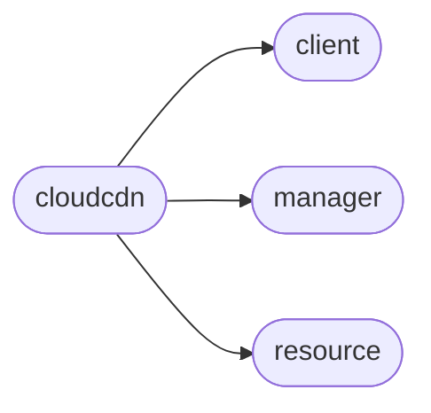

# Pyrax Cloudcdn

[_Documentation generated by Documatic_](https://www.documatic.com)

<!---Documatic-section-Codebase Structure-start--->
## Codebase Structure

<!---Documatic-block-system_architecture-start--->

<!---Documatic-block-system_architecture-end--->

# #
<!---Documatic-section-Codebase Structure-end--->

<!---Documatic-section-pyrax.cloudcdn.CloudCDNClient-start--->
## [pyrax.cloudcdn.CloudCDNClient](8-pyrax_cloudcdn.md#pyrax.cloudcdn.CloudCDNClient)

<!---Documatic-section-CloudCDNClient-start--->
<!---Documatic-block-pyrax.cloudcdn.CloudCDNClient-start--->
<details>
	<summary><code>pyrax.cloudcdn.CloudCDNClient</code> code snippet</summary>

```python
class CloudCDNClient(BaseClient):

    def __init__(self, *args, **kwargs):
        super(CloudCDNClient, self).__init__(*args, **kwargs)
        self.name = 'Cloud CDN'

    def _configure_manager(self):
        """
        Creates the Manager instances to handle monitoring.
        """
        self._flavor_manager = CloudCDNFlavorManager(self, uri_base='flavors', resource_class=CloudCDNFlavor, response_key=None, plural_response_key='flavors')
        self._services_manager = CloudCDNServiceManager(self, uri_base='services', resource_class=CloudCDNService, response_key=None, plural_response_key='services')

    def ping(self):
        """Ping the server

        Returns None if successful, or raises some exception...TODO
        """
        self.method_get('/ping')

    def list_flavors(self):
        """List CDN flavors."""
        return self._flavor_manager.list()

    def get_flavor(self, flavor_id):
        """Get one CDN flavor."""
        return self._flavor_manager.get(flavor_id)

    def list_services(self, limit=None, marker=None):
        """List CDN services."""
        return self._services_manager.list(limit=limit, marker=marker)

    def get_service(self, service_id):
        """Get one CDN service."""
        return self._services_manager.get(service_id)

    def create_service(self, name, flavor_id, domains, origins, restrictions=None, caching=None):
        """Create a new CDN service.

        Arguments:
        name: The name of the service.
        flavor_id: The ID of the flavor to use for this service.
        domains: A list of dictionaries, each of which has a required
                 key "domain" and optional key "protocol" (the default
                 protocol is http).
        origins: A list of dictionaries, each of which has a required
                 key "origin" which is the URL or IP address to pull
                 origin content from. Optional keys include "port" to
                 use a port other than the default of 80, and "ssl"
                 to enable SSL, which is disabled by default.
        caching: An optional

        """
        return self._services_manager.create(name, flavor_id, domains, origins, restrictions, caching)

    def patch_service(self, service_id, changes):
        """Update a CDN service with a patch

        Arguments:
        service_id: The ID of the service to update.
        changes: A list of dictionaries containing the following keys:
                 op, path, and value. The "op" key can be any of the
                 following actions: add, replace, or remove. Path
                 is the path to update. A value must be specified for
                 add or replace ops, but can be omitted for remove.
        """
        self._services_manager.patch(service_id, changes)

    def delete_service(self, service):
        """Delete a CDN service."""
        self._services_manager.delete(service)

    def delete_assets(self, service_id, url=None, all=False):
        """Delete CDN assets

        Arguments:
        service_id: The ID of the service to delete from.
        url: The URL at which to delete assets
        all: When True, delete all assets associated with the service_id.

        You cannot specifiy both url and all.
        """
        self._services_manager.delete_assets(service_id, url, all)

    def list(self, limit=None, marker=None):
        """Not applicable in Cloud CDN."""
        raise NotImplementedError

    def get(self, item):
        """Not applicable in Cloud CDN."""
        raise NotImplementedError

    def create(self, *args, **kwargs):
        """Not applicable in Cloud CDN."""
        raise NotImplementedError

    def delete(self, item):
        """Not applicable in Cloud CDN."""
        raise NotImplementedError

    def find(self, **kwargs):
        """Not applicable in Cloud CDN."""
        raise NotImplementedError

    def findall(self, **kwargs):
        """Not applicable in Cloud CDN."""
        raise NotImplementedError
```
</details>
<!---Documatic-block-pyrax.cloudcdn.CloudCDNClient-end--->
<!---Documatic-section-CloudCDNClient-end--->

# #
<!---Documatic-section-pyrax.cloudcdn.CloudCDNClient-end--->

[_Documentation generated by Documatic_](https://www.documatic.com)