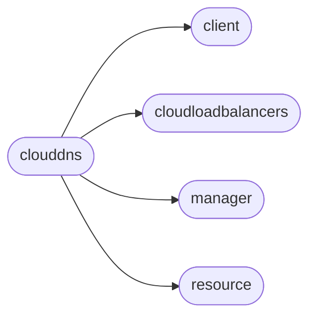

# Pyrax Clouddns

[_Documentation generated by Documatic_](https://www.documatic.com)

<!---Documatic-section-Codebase Structure-start--->
## Codebase Structure

<!---Documatic-block-system_architecture-start--->

<!---Documatic-block-system_architecture-end--->

# #
<!---Documatic-section-Codebase Structure-end--->

<!---Documatic-section-pyrax.clouddns.CloudDNSClient-start--->
## [pyrax.clouddns.CloudDNSClient](9-pyrax_clouddns.md#pyrax.clouddns.CloudDNSClient)

<!---Documatic-section-CloudDNSClient-start--->
<!---Documatic-block-pyrax.clouddns.CloudDNSClient-start--->
<details>
	<summary><code>pyrax.clouddns.CloudDNSClient</code> code snippet</summary>

```python
class CloudDNSClient(BaseClient):
    name = 'Cloud DNS'

    def _configure_manager(self):
        """
        Creates a manager to handle the instances, and another
        to handle flavors.
        """
        self._manager = CloudDNSManager(self, resource_class=CloudDNSDomain, response_key='domains', plural_response_key='domains', uri_base='domains')

    def method_get(self, uri, **kwargs):
        """
        Overload the method_get function in order to retry on empty body
        responses from the Cloud DNS API
        """
        for i in six.moves.range(3):
            (resp, body) = super(CloudDNSClient, self).method_get(uri, **kwargs)
            if body:
                return (resp, body)
        raise exc.ServiceResponseFailure('The Cloud DNS service failed to respond to the request.')

    def set_timeout(self, timeout):
        """
        Sets the amount of time that calls will wait for a response from
        the DNS system before timing out. Setting the timeout to zero will
        cause execution to wait indefinitely until the call completes.
        """
        self._manager._set_timeout(timeout)

    def set_delay(self, delay):
        """
        Changes the interval that the program will pause in between attempts to
        see if a request has completed.
        """
        self._manager._set_delay(delay)

    def list(self, limit=None, offset=None):
        """Returns a list of all resources."""
        return self._manager.list(limit=limit, offset=offset)

    def list_previous_page(self):
        """Returns the previous page of results."""
        return self._manager.list_previous_page()

    def list_next_page(self):
        """Returns the next page of results."""
        return self._manager.list_next_page()

    def get_domain_iterator(self):
        """
        Returns an iterator that will return each available domain. If there are
        more than the limit of 100 domains, the iterator will continue to fetch
        domains from the API until all domains have been returned.
        """
        return DomainResultsIterator(self._manager)

    @assure_domain
    def changes_since(self, domain, date_or_datetime):
        """
        Gets the changes for a domain since the specified date/datetime.
        The date can be one of:
            - a Python datetime object
            - a Python date object
            - a string in the format 'YYYY-MM-YY HH:MM:SS'
            - a string in the format 'YYYY-MM-YY'

        It returns a list of dicts, whose keys depend on the specific change
        that was made. A simple example of such a change dict:

            {u'accountId': 000000,
             u'action': u'update',
             u'changeDetails': [{u'field': u'serial_number',
               u'newValue': u'1354038941',
               u'originalValue': u'1354038940'},
              {u'field': u'updated_at',
               u'newValue': u'Tue Nov 27 17:55:41 UTC 2012',
               u'originalValue': u'Tue Nov 27 17:55:40 UTC 2012'}],
             u'domain': u'example.com',
             u'targetId': 00000000,
             u'targetType': u'Domain'}
        """
        return domain.changes_since(date_or_datetime)

    @assure_domain
    def export_domain(self, domain):
        """
        Provides the BIND (Berkeley Internet Name Domain) 9 formatted contents
        of the requested domain. This call is for a single domain only, and as
        such, does not provide subdomain information.

        Sample export:

            {u'accountId': 000000,
             u'contentType': u'BIND_9',
             u'contents': u'example.com.	3600	IN	SOA	ns.rackspace.com. '
                'foo@example.com. 1354202974 21600 3600 1814400 500'
                'example.com.	3600	IN	NS	dns1.stabletransit.com.'
                'example.com.	3600	IN	NS	dns2.stabletransit.com.',
             u'id': 1111111}
        """
        return domain.export()

    def import_domain(self, domain_data):
        """
        Takes a string in the BIND 9 format and creates a new domain. See the
        'export_domain()' method for a description of the format.
        """
        return self._manager.import_domain(domain_data)

    @assure_domain
    def update_domain(self, domain, emailAddress=None, ttl=None, comment=None):
        """
        Provides a way to modify the following attributes of a domain
        record:
            - email address
            - ttl setting
            - comment
        """
        return domain.update(emailAddress=emailAddress, ttl=ttl, comment=comment)

    @assure_domain
    def delete(self, domain, delete_subdomains=False):
        """
        Deletes the specified domain and all of its resource records. If the
        domain has subdomains, each subdomain will now become a root domain. If
        you wish to also delete any subdomains, pass True to 'delete_subdomains'.
        """
        domain.delete(delete_subdomains=delete_subdomains)

    @assure_domain
    def list_subdomains(self, domain, limit=None, offset=None):
        """
        Returns a list of all subdomains for the specified domain.
        """
        return domain.list_subdomains(limit=limit, offset=offset)

    def get_subdomain_iterator(self, domain, limit=None, offset=None):
        """
        Returns an iterator that will return each available subdomain for the
        specified domain. If there are more than the limit of 100 subdomains,
        the iterator will continue to fetch subdomains from the API until all
        subdomains have been returned.
        """
        return SubdomainResultsIterator(self._manager, domain=domain)

    def list_subdomains_previous_page(self):
        """Returns the previous page of subdomain results."""
        return self._manager.list_subdomains_previous_page()

    def list_subdomains_next_page(self):
        """Returns the next page of subdomain results."""
        return self._manager.list_subdomains_next_page()

    @assure_domain
    def list_records(self, domain, limit=None, offset=None):
        """
        Returns a list of all records configured for the specified domain.
        """
        return domain.list_records(limit=limit, offset=offset)

    def get_record_iterator(self, domain):
        """
        Returns an iterator that will return each available DNS record for the
        specified domain. If there are more than the limit of 100 records, the
        iterator will continue to fetch records from the API until all records
        have been returned.
        """
        return RecordResultsIterator(self._manager, domain=domain)

    def list_records_previous_page(self):
        """Returns the previous page of record results."""
        return self._manager.list_records_previous_page()

    def list_records_next_page(self):
        """Returns the next page of record results."""
        return self._manager.list_records_next_page()

    @assure_domain
    def search_records(self, domain, record_type, name=None, data=None):
        """
        Returns a list of all records configured for the specified domain
        that match the supplied search criteria.
        """
        return domain.search_records(record_type=record_type, name=name, data=data)

    @assure_domain
    def find_record(self, domain, record_type, name=None, data=None):
        """
        Returns a single record for this domain that matches the supplied
        search criteria.

        If no record matches, a DomainRecordNotFound exception will be raised.
        If more than one matches, a DomainRecordNotUnique exception will
        be raised.
        """
        return domain.find_record(record_type=record_type, name=name, data=data)

    @assure_domain
    def add_records(self, domain, records):
        """
        Adds the records to this domain. Each record should be a dict with the
        following keys:
            - type (required)
            - name (required)
            - data (required)
            - ttl (optional)
            - comment (optional)
            - priority (required for MX and SRV records; forbidden otherwise)
        """
        return domain.add_records(records)
    add_record = add_records

    @assure_domain
    def get_record(self, domain, record):
        """
        Gets the full information for an existing record or record ID for the
        specified domain.
        """
        return domain.get_record(record)

    @assure_domain
    def update_record(self, domain, record, data=None, priority=None, ttl=None, comment=None):
        """
        Modifies an existing record for a domain.
        """
        return domain.update_record(record, data=data, priority=priority, ttl=ttl, comment=comment)

    @assure_domain
    def update_records(self, domain, records):
        """
        Modifies multiple existing records for a domain. Each record to be
        updated should be a dict with following required keys:
            - id
            - name

        Each record must also contain one or more of the following optional
        keys:
            - data
            - ttl
            - comment
            - priority (optional for MX and SRV records; forbidden otherwise)
        """
        return domain.update_records(records)

    @assure_domain
    def delete_record(self, domain, record):
        """
        Deletes an existing record for this domain.
        """
        return domain.delete_record(record)

    def list_ptr_records(self, device):
        """
        Returns a list of all PTR records configured for this device.
        """
        return self._manager.list_ptr_records(device)

    def add_ptr_records(self, device, records):
        """
        Adds one or more PTR records to the specified device.
        """
        return self._manager.add_ptr_records(device, records)

    def update_ptr_record(self, device, record, domain_name, data=None, ttl=None, comment=None):
        """
        Updates a PTR record with the supplied values.
        """
        return self._manager.update_ptr_record(device, record, domain_name, data=data, ttl=ttl, comment=comment)

    def delete_ptr_records(self, device, ip_address=None):
        """
        Deletes the PTR records for the specified device. If 'ip_address'
        is supplied, only the PTR records with that IP address will be deleted.
        """
        return self._manager.delete_ptr_records(device, ip_address=ip_address)

    def get_absolute_limits(self):
        """
        Returns a dict with the absolute limits for the current account.
        """
        (resp, body) = self.method_get('/limits')
        absolute_limits = body.get('limits', {}).get('absolute')
        return absolute_limits

    def get_rate_limits(self):
        """
        Returns a dict with the current rate limit information for domain
        and status requests.
        """
        (resp, body) = self.method_get('/limits')
        rate_limits = body.get('limits', {}).get('rate')
        ret = []
        for rate_limit in rate_limits:
            limits = rate_limit['limit']
            uri_limits = {'uri': rate_limit['uri'], 'limits': limits}
            ret.append(uri_limits)
        return ret
```
</details>
<!---Documatic-block-pyrax.clouddns.CloudDNSClient-end--->
<!---Documatic-section-CloudDNSClient-end--->

# #
<!---Documatic-section-pyrax.clouddns.CloudDNSClient-end--->

[_Documentation generated by Documatic_](https://www.documatic.com)